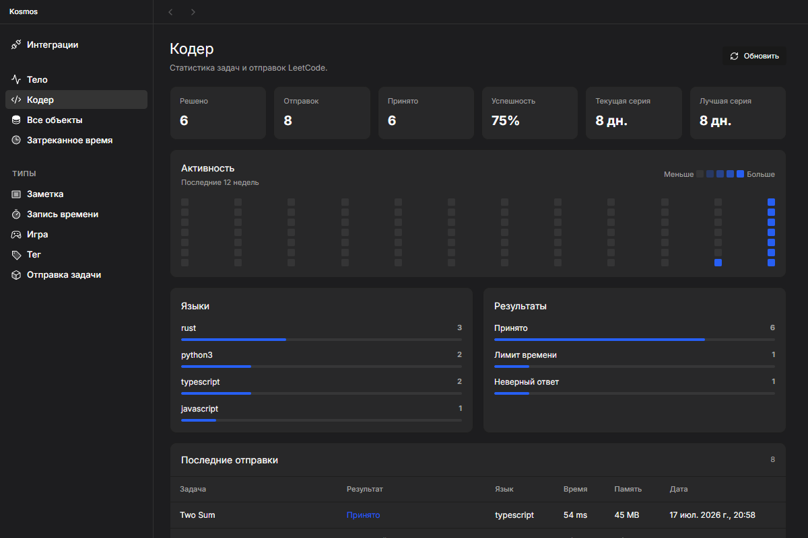

# Evidence — LeetCode auth, incremental sync and Coder

## Outcome

- Fresh LeetCode login clears the persistent partition first and closes its BrowserWindow immediately after fresh auth cookies appear, before credential verification/persistence.
- A second sync for the same provider fails fast instead of waiting behind startup/manual work.
- The first LeetCode import remains complete; later imports stop after a one-day overlap from the last successful sync.
- Dashboard contains a local/offline «Кодер» page with summary, streaks, 12-week activity, language/status breakdowns and recent submissions.

## Checks

- `bun test platform/desktop/electron/leetcode-auth-flow.test.ts platform/desktop/src/coder/useCoderStats.test.ts` — PASS, 3 tests.
- Isolated `cargo test -p kepler-backend integrations::tests::` with `.tmp/cargo-leetcode-tests` — PASS, 8 tests.
- `bun run --cwd platform/desktop typecheck` — PASS.
- `bun run --cwd platform/desktop build:js:shell` — PASS.
- `bun run ark:guard:writes` — PASS.
- `cargo fmt --all -- --check` — PASS.
- Targeted `oxlint` for changed desktop files — PASS.
- `bun run docs:check` — PASS.
- Headless Electron visual scenario opened Dashboard → Кодер with isolated seeded ARK data and passed once. A later evidence rerun hit the global 30-second Playwright timeout; the successful populated capture was inspected manually.

## Visual

## Scope notes

- No solution source code is fetched or stored.
- No release, version bump, commit or push was performed.
