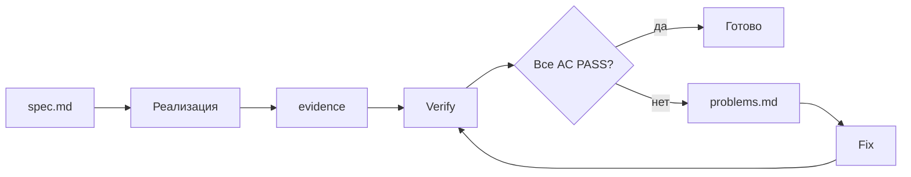

# AGENTS.md — Kosmos

<!-- AUTO-GENERATED by scripts/sync-agents-docs.mjs — do not edit; правь docs-site/ -->

Источник правды — `docs-site/`. Этот файл собирается автоматически из
соответствующих страниц документации скриптом `scripts/sync-agents-docs.mjs`.
Открой собранный сайт (`bun run docs:dev`, http://localhost:5173/) для
удобного чтения.

---

## Содержание

1. [Старт](#старт)
2. [Запреты](#запреты)
3. [Чек-листы](#чек-листы)
4. [Поддержка документации](#поддержка-документации)
5. [Сжатые правила](#сжатые-правила)
6. [Proof loop](#proof-loop)

---

## Старт

# Для AI-агента — старт работы

::: tip Прочитай это ПЕРВЫМ
Эта страница заменяет тонкие `AGENTS.md` / `CLAUDE.md` в корне. Полный контекст репо — в этом сайте документации. Все правила в одном месте.
:::

Ты работаешь в монорепо **Kosmos**. Перед любым изменением кода обязательно сверься с разделами ниже. Если задача нетривиальна — иди по [Proof loop](docs-site/concepts/proof-loop.md).

## За 30 секунд

- **Kosmos** = монорепо для личного софта. Bun workspaces.
- **ARK** = общий Rust+SQLite рантайм (`packages/ark-core`, бинарь `ark-core-rpc`).
- **Apps** говорят с ARK **только** через `@kosmos/ark` или `ark_core::db` (Rust direct writers).
- **Прямые SQL writes в ARK** из app services — **запрещены**.
- **Тесты** — только на изолированных БД.
- **Substantial-правки** — через `.agent/tasks/<DATE>-<slug>/` proof loop.

## Что должно сработать прежде, чем ты начнёшь редактировать код

Прочитай в указанном порядке:

1. **[Архитектура](docs-site/concepts/architecture.md)** — общая картина.
2. **[Модель данных ARK](docs-site/concepts/ark-objects.md)** — что за таблицы и типы.
3. **[Граница записи в ARK](docs-site/concepts/write-boundary.md)** — что можно, что нельзя.
4. **[Изоляция тестовых БД](docs-site/concepts/test-isolation.md)** — как писать тесты.
5. **[Proof loop](docs-site/concepts/proof-loop.md)** — как оформлять substantial-задачи.
6. **[Запреты и гварды](docs-site/agents/forbidden.md)** — список «никогда».
7. **[Чек-листы по областям](docs-site/agents/checklists.md)** — что прогнать перед сдачей.

## Принципы работы

### 1. Не угадывай — читай источник

Перед правкой в `apps/<name>` прочитай `apps/<name>/AGENTS.md`. Перед правкой в data-слое — `docs/ARK-READONLY-SQL-BOUNDARY.md` и [Граница записи](docs-site/concepts/write-boundary.md).

### 2. Меньший defensible diff

Не «попутно отрефактори». Делай только то, что в задаче.

### 3. Не добавляй лишнее

- Не добавляй обработку ошибок для случаев, которые не могут случиться.
- Не добавляй fallback'и «на всякий случай».
- Не добавляй комментарии, объясняющие **что**. Имена и так это делают.
- Не добавляй feature flags, когда можно просто изменить код.

### 4. Прогоняй гварды

После любой правки в data-слой:

```powershell
bun run ark:guard:writes
```

После любой substantial-правки:

```powershell
bun run ark:smoke
```

### 5. Не клейми «готово» если AC не PASS

Если задача через proof loop — каждый AC должен быть `PASS` в `evidence.md`. Не пиши «готово» в чате, пока это не так.

## Карта приложений и пакетов

Когда пользователь упоминает имя — ты должен моментально знать, где это.

| Имя | Где | Что |
|---|---|---|
| **Eden** | `apps/eden/ts` | заметки (Vue + Electron + Heart Rust) |
| **Delphi** | `apps/delphi/ts` | задачи (Electron) |
| **Arrancador** | `apps/arrancador` | игровая библиотека (Electron) |
| **Dashboard** | `apps/dashboard` | read-only аналитика (Electron) |
| **Horologion** | `apps/horologion` | трекер времени, pomodoro (WIP). `time_entry_obj` + общий `tag_obj` |
| **Digital Cave** | `apps/digital-cave` | focus-блокер (TBD, имя зарезервировано) |
| **ark-service** | `apps/ark-service` | Android Room ContentProvider для `apps/delphi/kotlin` (отдельно от desktop ARK) |
| **ark-core** | `packages/ark-core/rust` | Rust runtime + ark-core-rpc |
| **@kosmos/ark** | `packages/kosmos-ark` | TS SDK |
| **ark-relay-server** | `services/ark-relay-server` | WebSocket relay (опционально, для NAT) |
| **kosmos-visuals** | `packages/kosmos-visuals` | UI токены, тема, компоненты |
| **usage-tracker** | `services/usage-tracker` | Rust фон-сервис, пишет usage в ARK |

## Что считается substantial (нужен proof loop)

- Новая фича приложения.
- Новый ARK endpoint в `ark-core-rpc` или метод в `@kosmos/ark`.
- Изменение схемы SQLite.
- Изменение sync-протокола.
- Изменение write-boundary (правил доступа к данным).
- Нетривиальный багфикс (затрагивающий несколько файлов).
- Архитектурное решение (требует ADR в `docs/`).

## Что НЕ substantial

- Опечатки.
- Локальное переименование переменной.
- Косметика README / комментариев.
- Edit-level правка одной строки в UI.
- Обновление зависимости patch-версии.

Для не-substantial proof loop **не нужен**. Просто правь.

## Дальше

- [Чек-листы по областям](docs-site/agents/checklists.md) — что прогнать перед сдачей в каждой области.
- [Запреты и гварды](docs-site/agents/forbidden.md) — список «никогда».
- [Шаблоны спецификаций](docs-site/agents/spec-templates.md) — типовые `spec.md` для proof loop.

Полный справочник правил — [Правила репозитория](docs-site/reference/rules.md).

---

## Запреты

# Запреты и гварды

::: danger Никогда
Этот список — нерушимое. Не «лучше не делать», а **запрещено**. Если ты как агент думаешь нарушить что-то отсюда — остановись и спроси человека.
:::

## ARK writes

- ❌ **Прямой SQL `INSERT` / `UPDATE` / `DELETE`** в `objects`, `object_types`, `object_links`, `tracked_apps`, `usage_sessions`, `usage_events`, `sync_kv` из **app TS services**.
- ❌ **Открытие ARK SQLite на запись** в app services через `better-sqlite3`, `sqlite3`, `node:sqlite` и т.п.
- ❌ Renderer открывает SQLite (любой) напрямую.

## Sync

- ❌ Direct Rust writer пишет в ARK без вызова `ark_core::db::bump_sync_version_vector`.
- ❌ Ослабление self-peer filtering при изменениях в sync startup.
- ❌ Ослабление routable-address filtering при изменениях в peer persistence.
- ❌ Изменение sync wire-протокола из `snake_case` в что-то другое.
- ❌ Destructive schema migration (`DROP TABLE`, `ALTER COLUMN` несовместимо). Только `CREATE TABLE IF NOT EXISTS` и additive.

## Тесты

- ❌ Дефолт пути к user ARK DB (`%APPDATA%\Kosmos\ark.db`) в тестах.
- ❌ Захардкоженный путь к real user dir (типа `C:\Users\me\AppData\...`).
- ❌ Запуск миграции/backfill против реальной ARK DB «чтобы проверить».
- ❌ Запуск Playwright против user vault Eden.

## Proof loop

- ❌ Объявить задачу завершённой, пока **каждый** AC не `PASS`.
- ❌ Редактировать `spec.md` после старта реализации.
- ❌ Fixer делает «попутный рефактор» вместе с fix'ом.

## Per-app запреты

### Eden

- ❌ Возврат к ripgrep как поисковому движку.
- ❌ Упрощение hardening для `save` / `move` / `delete` в `main/store.ts`.
- ❌ Возврат ручных `--titlebar-height` / `--titlebar-left-safe-area` костылей.
- ❌ Использование `vue-router` для titlebar history controls (нужна локальная история Eden).
- ❌ Deep import shared компонентов вместо public API `@kosmos/visuals`.
- ❌ Возврат `vite-plugin-electron` (миграция на `electron-vite` сделана).

### Delphi

- ❌ Восстановление, упаковка или использование legacy Delphi DB sidecar.
- ❌ Использование old todo таблиц как long-term fallback после миграции в `task_obj`.

### Arrancador

- ❌ In-process activity tracker / window polling loop внутри Arrancador.
- ❌ Arrancador-owned usage SQLite.
- ❌ Tauri зависимости / Tauri runtime пути.
- ❌ React зависимости / React runtime пути.

### Dashboard

- ❌ SQLite open в renderer.
- ❌ ARK queries вне `electron/services/analytics.ts`.
- ❌ Любые **writes** в ARK таблицы.
- ❌ Копирование shared sidebar / токенов внутрь `apps/dashboard`.

### usage-tracker

- ❌ Превращение в Windows Service.
- ❌ Добавление UI / tray icon / окон.
- ❌ Прямой SQL write без `ark_core::db` хелперов и без обновления `version_vector`.

## Файловые операции на Windows

::: danger Junction'ы bun workspaces
В этом репо `bun install` создаёт junction'ы (Windows-симлинки) в `apps/<name>/node_modules/@kosmos/<pkg>` → `packages/<pkg>`. PowerShell `Move-Item -Force` (и многие GUI-операции) **разрешают** junction'ы и удаляют **таргет** вместе с источником — а Корзину минуют. Так уже было потеряно несколько часов untracked-работы в `packages/kosmos-visuals/`. Восстановление возможно только если файлы успели попасть в asar предыдущего билда.
:::

- ❌ `Move-Item -Force` или `Remove-Item -Recurse -Force` на `apps/<name>/` целиком, пока внутри есть `node_modules/`. Сначала **удали** `apps/<name>/node_modules/` (`Remove-Item -Recurse -Force apps\<name>\node_modules`), и **только потом** перемещай или удаляй директорию.
- ❌ Переименование/перемещение `apps/<name>/` без предварительной коммитной зачистки untracked-файлов в `packages/*`. Если что-то ценное лежит как `??` в `git status` — закоммить или временно сохрани вне репо, иначе `Move-Item` уничтожит таргет junction'а навсегда.
- ❌ Удаление любых директорий внутри `apps/` или `packages/` через GUI-проводник Windows. Используй `git rm`, `Remove-Item` после удаления `node_modules`, или CLI с явным контролем.
- ❌ `rm -rf packages/...` или эквиваленты, если результат можно достичь через `git restore` / переключение веток.

## Git / tooling

- ❌ `--no-verify` при коммите.
- ❌ `git push --force` в `main` / `master`.
- ❌ `git reset --hard` или `git checkout .` для уничтожения чужих изменений.
- ❌ Амендить уже опубликованные коммиты.
- ❌ Коммит файлов с секретами (`.env`, `credentials.json`).
- ❌ Коммит `dist/`, `build/`, `coverage/`, `.tmp/`, `.e2e/`, `node_modules/`.
- ❌ Создание новых правил в `MEMORY.md` или AGENTS.md без согласования с человеком.

## UI

- ❌ Английский язык в UI приложений (placeholder'ы, лейблы, кнопки, эмпти-стейты, заголовки). User-facing — только русский. Английский OK для technical id'ов (`task_obj`, `time_entry_obj`).
- ❌ Hardcoded `#hex`, `rgb()`, кастомные шрифты в renderer-коде. Все цвета / радиусы / шрифты — через `var(--*)` из `@kosmos/visuals`.
- ❌ Свой titlebar / safe-area код. Всегда через `<DesktopChrome>` + `<DesktopContentSurface>`.

## Общая дисциплина

- ❌ «Попутно отрефакторил» вместе с задачей. Один логический change — один коммит.
- ❌ Добавление защитного кода для невозможных случаев.
- ❌ Создание новых документов (`.md` файлов) без явного запроса.
- ❌ Изменение `package.json` без видимой причины (особенно версий зависимостей).
- ❌ Игнорирование AC из `spec.md`. Если AC кажется неверным — это новая задача / обсуждение.
- ❌ Объявление «всё работает» без прогона гвардов и smoke.

## Гварды-команды

Прогнать **обязательно** в указанных случаях:

```powershell
# Перед PR в data services (apps/*/electron/main/services/, services/usage-tracker)
bun run ark:guard:writes

# Перед PR в любую substantial-задачу
bun run ark:smoke
```

См. [Smoke-матрица](docs-site/reference/smoke-matrix.md).

---

## Чек-листы

# Чек-листы по областям

Перед тем как сказать «готово» — пройди соответствующий чек-лист. По одному пункту, не пропускай.

## Я правил ARK runtime (`packages/ark-core/rust`)

- [ ] `cargo test --manifest-path packages\ark-core\rust\Cargo.toml` — зелёный.
- [ ] `cargo build --manifest-path packages\ark-core\rust\Cargo.toml --bin ark-core-rpc` — собирается.
- [ ] Если менял schema — миграция additive (`CREATE TABLE IF NOT EXISTS`), не destructive.
- [ ] Если менял sync — добавлены или обновлены тесты миграции/репликации.
- [ ] Если менял wire-протокол — остался `snake_case`.
- [ ] Self-peer filtering и routable-address filtering не ослаблены.
- [ ] `bun run --cwd packages/kosmos-ark typecheck` — зелёный (если правил публичные типы).

## Я правил `@kosmos/ark` (`packages/kosmos-ark`)

- [ ] `bun run --cwd packages/kosmos-ark typecheck` — зелёный.
- [ ] `bun run --cwd packages/kosmos-ark build` — собирается.
- [ ] Если добавил новый метод — он реальный RPC к sidecar, не SDK-фильтрация.
- [ ] Self-managed и injected режимы оба работают, request id есть только в self-managed.

## Я правил Eden (`apps/eden/ts`)

- [ ] `bun run --cwd apps/eden/ts build` — собирается без ошибок.
- [ ] `bun run --cwd apps/eden/ts test:e2e` — зелёный.
- [ ] `bun run --cwd apps/eden/ts lint` — без warnings.
- [ ] `bun x tsc --noEmit` (в `apps/eden/ts`) — зелёный.
- [ ] Не возвращён ripgrep, поиск через Heart/Tantivy / ARK FTS.
- [ ] Если трогал `main/store.ts` — hardening для `save/move/delete` не сломан.
- [ ] Desktop shell — через `DesktopChrome`/`DesktopContentSurface` из `@kosmos/visuals`. Никаких ручных `--titlebar-height` хаков.
- [ ] Если трогал тесты — изолированная БД, не user vault.

## Я правил Delphi (`apps/delphi/ts`)

- [ ] `bun run --cwd apps/delphi/ts build` — собирается.
- [ ] `bun run --cwd apps/delphi/ts test` — зелёный.
- [ ] `bun run --cwd apps/delphi/ts e2e` — зелёный.
- [ ] Если правил task storage — пишет в `task_obj`, не в legacy todos.
- [ ] Не восстановлен legacy Delphi DB sidecar.
- [ ] Тесты — на изолированной БД.

## Я правил Arrancador (`apps/arrancador`)

- [ ] `bun run --cwd apps/arrancador typecheck` — зелёный.
- [ ] `bun run --cwd apps/arrancador build:renderer` / `build:main` / `build:preload` — собираются.
- [ ] `bun run --cwd apps/arrancador test` — зелёный.
- [ ] `bun run --cwd apps/arrancador smoke:packaged` — зелёный (если правил packaging / Electron main).
- [ ] Не добавлен in-process tracker / window polling / app-owned usage SQLite.
- [ ] Не добавлены Tauri или React зависимости.
- [ ] ARK writes идут через `@kosmos/ark`.
- [ ] Read-only SQLite — только fallback, отделён от write paths.

## Я правил Dashboard (`apps/dashboard`)

- [ ] `bun run --cwd apps/dashboard build` — собирается.
- [ ] `bun run --cwd apps/dashboard test:e2e` — зелёный.
- [ ] `bun run --cwd apps/dashboard smoke:seed` + `smoke:analytics` — зелёные.
- [ ] Renderer не открывает SQLite напрямую.
- [ ] ARK queries только в `electron/services/analytics.ts`.
- [ ] Никаких writes в ARK таблицы.
- [ ] `@kosmos/visuals` через import/alias, не скопирован.

## Я правил usage-tracker (`services/usage-tracker`)

- [ ] `cargo test --manifest-path services\usage-tracker\Cargo.toml` — зелёный.
- [ ] Прямые ARK writes используют `ark_core::db` хелперы.
- [ ] `lan_sync.version_vector` обновляется после прямых писей.
- [ ] Default DB path остался `%APPDATA%\Kosmos\ark.db`.
- [ ] Тесты переопределяют DB path в `.tmp` / `.e2e` / OS temp.
- [ ] Tracker остаётся user-level, не Windows Service.

## Я правил `kosmos-visuals` (`packages/kosmos-visuals`)

- [ ] Не сломан public API (`index.ts` экспортирует те же имена).
- [ ] Если меняешь CSS-переменные в `theme/css-variables.css` — сразу отрази в `docs-site/.vitepress/theme/custom.css`.
- [ ] Token-файлы (`tokens/*.ts`) остаются source of truth для соответствующих переменных.

## Я правил документацию (`docs-site/`)

- [ ] `bun run docs:build` — собирается.
- [ ] Все внутренние ссылки рабочие.
- [ ] Русский язык, без английских заглушек.
- [ ] Не дублирую правила, лучше ссылка на канон-страницу.
- [ ] Обновил `MEMORY.md` или связанные `AGENTS.md` если факты изменились.

## Я делал substantial задачу через proof loop

- [ ] Создан `.agent/tasks/<DATE>-<slug>/spec.md` **до** реализации.
- [ ] `spec.md` содержит явные AC1..ACn, проверяемые утверждения.
- [ ] `evidence.md` со ссылками на `raw/<cmd>.md` логи.
- [ ] `evidence.json` с PASS/FAIL по каждому AC.
- [ ] Свежая верификация после `evidence.md` — против текущего кода.
- [ ] Если был FAIL — `problems.md` + минимальный fix + reverify.
- [ ] **Каждый** AC = PASS, иначе не клейми «готово».

## Общий финальный чек-лист

- [ ] `bun run ark:guard:writes` — зелёный (если трогал data-слой).
- [ ] `bun run ark:smoke` — зелёный (для substantial задач).
- [ ] Коммит-сообщение осмысленное (про **почему**, не «add big»).
- [ ] Не амендил опубликованные коммиты.
- [ ] Не использовал `--no-verify` для коммита.
- [ ] Все новые `.tmp` / `.e2e` / `dist/` пути в `.gitignore`.

---

## Поддержка документации

# Поддержка документации в актуальном состоянии

::: danger Ты — агент, читающий это
Эта страница — **обязательный** контекст. Документация Kosmos сейчас — единственный источник правды для людей и агентов. Если она устарела, ты как агент примешь неверные решения и сломаешь ожидания пользователя. Перед закрытием **любой** substantial-задачи пройди раздел [«Что проверить»](#что-проверить).
:::

## Базовый принцип

```
Изменил поведение / API / структуру → обновил docs-site/ → bun run docs:sync → bun run docs:check
```

Документация **обязана** меняться в **той же** задаче, что и код. Не «потом», не «когда руки дойдут». Иначе drift начинается в день один.

## Когда обновлять документацию

| Что изменил | Где обновить |
|---|---|
| Добавил/убрал команду в `package.json` | `docs-site/reference/commands.md` + соответствующее место в `docs-site/apps/<name>.md` |
| Изменил ARK schema / endpoint в `ark-core-rpc` | `docs-site/concepts/ark-objects.md` + `docs-site/packages/ark-core.md` |
| Добавил/изменил метод в `@kosmos/ark` | `docs-site/packages/kosmos-ark.md` + примеры в `docs-site/concepts/ark-objects.md` |
| Изменил структуру папок приложения | `docs-site/apps/<name>.md` и `docs-site/guide/layout.md` |
| Удалил/перенёс файл, упомянутый в доке | grep по `docs-site/` на имя файла → обновить или удалить упоминание |
| Изменил sync-протокол / HLC / relay | `docs-site/concepts/sync.md` |
| Добавил/убрал зависимость в стеке | `docs-site/guide/tooling.md` |
| Добавил smoke-команду | `docs-site/reference/smoke-matrix.md` |
| Изменил правило/запрет | `docs-site/agents/forbidden.md` или `docs-site/reference/rules.md` |
| Принял архитектурное решение | новый файл `docs/<DECISION>.md` (полный ADR) + ссылка в `docs-site/reference/decisions.md` |
| Изменил дизайн-токены `kosmos-visuals` | `docs-site/packages/kosmos-visuals.md` + при необходимости `docs-site/.vitepress/theme/custom.css` |
| Создал/убрал `object_type` | `docs-site/concepts/ark-objects.md` (таблица «Известные типы») + соответствующая app-страница |
| Запланировал фичу / нашёл баг приложения | `docs-site/apps/<name>-roadmap.md` (см. [Roadmap-конвенция](#roadmap)) |

## Когда **НЕ** надо трогать документацию

- Локальное переименование private-переменной без публичного эффекта.
- Чистка `console.log`, опечатки в комментариях.
- Edit-level правка одной строки в UI без изменения поведения.
- Patch-обновление зависимости без эффекта на пользователя.

## Workflow обновления

1. **Сначала правь под `docs-site/`.** Не правь сгенерированные `AGENTS.md` / `CLAUDE.md` / `apps/*/AGENTS.md` напрямую — твои изменения будут затёрты при следующем `docs:sync`.
2. **Запусти `bun run docs:sync`.** Регенерирует все `AGENTS.md`, `CLAUDE.md`, `llms.txt`.
3. **Запусти `bun run docs:check`.** Проверяет, что упомянутые в доке пути/команды/файлы реально существуют.
4. **Коммить и доку, и код в одном PR.** Не отдельно.

## Что проверить перед закрытием задачи

Чек-лист обязательный, не пропускай:

- [ ] Я перечитал `docs-site/apps/<которые трогал>.md` — там нет устаревших фактов?
- [ ] Если добавил/убрал команду — отразил в `docs-site/reference/commands.md`?
- [ ] Если изменил публичный API (ARK endpoint, `@kosmos/ark` метод, preload) — обновил соответствующую страницу пакета/приложения?
- [ ] Если ввёл новое архитектурное решение — есть ADR в `docs/` и ссылка в `docs-site/reference/decisions.md`?
- [ ] `bun run docs:sync` прошёл без ошибок.
- [ ] `bun run docs:check` зелёный (нет stale-references).
- [ ] `bun run docs:build` собирается без warnings про невалидные ссылки.

## Команда `docs:check`

Полная аудит-команда:

```powershell
bun run docs:check
```

Что делает (`scripts/check-docs-freshness.mjs`):

- Парсит все `docs-site/**/*.md` (кроме сгенерированных).
- Извлекает упоминания путей (`apps/<x>/...`, `packages/<x>/...`, `services/<x>/...`, `scripts/<x>.<ext>`, `docs/<x>.md`).
- Проверяет, что эти пути существуют в репозитории.
- Извлекает упоминания команд (`bun run <name>`, `cargo <subcmd>`).
- Проверяет, что `bun run <name>` есть в каком-то `package.json` workspace'а.
- Извлекает внутренние ссылки (`/concepts/architecture` и т.п.) и проверяет, что страница существует.
- Печатает stale-references как warnings.

Если падает — открой соответствующий `.md` и обнови или удали упоминание.

## Регенерация при подозрении на drift

Если кажется, что `AGENTS.md` или `llms.txt` устарели (например, после ребейза/мерджа):

```powershell
bun run docs:sync       # перегенерация всех auto-context файлов
bun run docs:check      # верификация
git diff                # увидишь что регенерация поменяла
```

## Анти-паттерны

- ❌ Править `AGENTS.md` напрямую «потому что я знаю что мне нужно». Будет затёрто.
- ❌ Откладывать обновление доки на «потом». Drift начинается мгновенно.
- ❌ Документировать **намерения**, а не **факты**. Не пиши «в будущем будет X». Пиши «X есть» или вообще не упоминай.
- ❌ Скрывать удаление функционала. Если убрал — убери из доки.
- ❌ Дублировать концепт на несколько страниц. Концепт живёт на одной странице, остальные ссылаются.

## Что важно понять про auto-generation

Поток:

```
docs-site/**/*.md     → bun run docs:sync →    AGENTS.md / CLAUDE.md / apps/*/AGENTS.md / llms.txt
                                              (все помечены <!-- AUTO-GENERATED -->)
```

Скрипт `scripts/sync-agents-docs.mjs` берёт:

- `docs-site/agents/index.md` + `forbidden.md` + `checklists.md` + `reference/rules.md` + `concepts/proof-loop.md` → корневой `AGENTS.md` и `CLAUDE.md`.
- `docs-site/apps/<name>.md` + общие запреты → `apps/<name>/AGENTS.md`.
- Весь набор ключевых страниц inline → `docs-site/public/llms.txt`.

Если меняешь логику генерации — правь сам `scripts/sync-agents-docs.mjs`, потом `bun run docs:sync`.

## Roadmap

У каждого приложения может быть **отдельная страница roadmap** — `docs-site/apps/<name>-roadmap.md`. Это список того, что хочется сделать в приложении / баги / TODO. Источник информации:

- Что-то обсудили с пользователем — записываешь в roadmap (не в код, не в TODO.md, не «запомнишь»).
- Нашёл баг или ограничение в процессе работы — записываешь в roadmap → `Баги / замечания`.

### Структура roadmap-страницы

Три обязательных секции:

1. **Ближайшее** — фичи, над которыми работают сейчас или планируют скоро (по приоритету ↓). Если фича в работе — пометка статуса (`WIP — scaffold`, `WIP — UI готов`).
2. **Потом** — идеи / nice-to-have. Не критично, но не теряем.
3. **Баги / замечания** — открытые проблемы.

Пример — [Horologion Roadmap](docs-site/apps/horologion-roadmap.md).

### Как поддерживать

- **Когда фича в roadmap начинает делаться** — оставляй её в «Ближайшее» с пометкой статуса.
- **Когда фича завершена** — убирай из roadmap и фиксируй в обзоре приложения (`docs-site/apps/<name>.md`).
- **Баг исправили** — убираем из «Баги».
- **Не дублируй с code-комментариями `// TODO`** — комментарии в коде про *локальное место*; roadmap про *направление приложения*.

### Когда roadmap-страницы нет

Создаёшь новую — добавь её в `docs-site/.vitepress/config.ts` sidebar под соответствующим приложением как «`<Name> — Roadmap`».

## Связанные документы

- [Старт работы](docs-site/agents.md) — общая стартовая страница агента.
- [Чек-листы по областям](docs-site/agents/checklists.md) — что прогнать после правок в коде.
- [Шаблоны спецификаций](docs-site/agents/spec-templates.md) — proof-loop templates.
- [Команды и скрипты](docs-site/reference/commands.md).

---

## Сжатые правила

# Правила репозитория

Сжатый чек-лист правил. Полные тексты — в `docs/`, `AGENTS.md` каждого приложения и в [концептах](docs-site/concepts/architecture.md).

## 1. Граница записи в ARK

::: danger
- Все ARK writes через `@kosmos/ark` (TS) или `ark_core::db` (Rust).
- **Прямые SQL writes** в `objects` / `object_types` / `object_links` / `tracked_apps` / `usage_sessions` / `usage_events` / `sync_kv` из app services — **запрещены**.
- Dashboard — read-only.
- Перед PR в data services: `bun run ark:guard:writes`.
:::

См. [Граница записи в ARK](docs-site/concepts/write-boundary.md).

## 2. Read-only SQL

- Renderer **никогда** не открывает SQLite напрямую.
- В Electron main read-only SQLite — fallback, отделённый от write paths.
- Dashboard — единственный полноценный read-only inspector.
- Read-only пути **не запускаются** против user DB в автотестах.

См. [Read-only SQL boundary](docs-site/concepts/readonly-sql.md).

## 3. Изоляция тестовых БД

::: danger
- Тесты / smoke / Playwright / migration verify — **только** на изолированных DB.
- Разрешённые пути: `.tmp`, `.e2e`, `.agent/tasks/<TASK_ID>/smoke/`, OS temp.
- Любой тест, дефолтящийся в user data dir, **отвергается** на code review.
:::

См. [Изоляция тестовых БД](docs-site/concepts/test-isolation.md).

## 4. Proof loop

Substantial-правки идут через `.agent/tasks/<DATE>-<slug>/`:

`spec.md` → реализация → `evidence.{md,json}` → если не PASS → `problems.md` → fix → reverify.

Каждый AC должен быть `PASS`. См. [Proof loop](docs-site/concepts/proof-loop.md).

## 5. Sync state у direct writers

- Любой Rust-writer, пишущий напрямую в синхронизируемые таблицы, **обязан** вызывать `ark_core::db::bump_sync_version_vector` (или хелпер, который это делает).
- Self-peer filtering и routable-address filtering — обязательные инварианты sync. Не ослабляй.

См. [Синхронизация](docs-site/concepts/sync.md).

## 6. Tooling-минимум

- `bun install` после клона.
- `bun run ark:guard:writes` перед PR в data-слой.
- `bun run ark:smoke` перед нетривиальным PR.
- `cargo test` в `packages/ark-core/rust` при правках runtime.

См. [Стек и инструменты](docs-site/guide/tooling.md) и [Smoke-матрица](docs-site/reference/smoke-matrix.md).

## 7. UI и Visuals

- Используй `@kosmos/visuals` для shared chrome / сайдбара / titlebar.
- **Не копируй** shared компоненты внутрь приложения.
- Не возвращай ручные titlebar-offset / safe-area хаки — есть `DesktopChrome` / `DesktopContentSurface`.

См. [kosmos-visuals](docs-site/packages/kosmos-visuals.md).

## 8. Запреты per-app

| Приложение | Не делать |
|---|---|
| Delphi | Восстанавливать legacy DB sidecar / использовать old todo таблицы как long-term fallback |
| Eden | Возвращаться к ripgrep, ломать `save/move/delete` hardening в `store.ts`, возвращать ручные titlebar-offset |
| Arrancador | Возвращать собственный usage tracker / window polling, добавлять Tauri или React пути |
| Dashboard | Открывать SQLite в renderer, дублировать ARK queries вне `electron/services/analytics.ts` |

## 9. Стиль коммитов и кода

- Коммит — про **почему**, не про **что**. Не «add big».
- Никаких `--no-verify`.
- Не амендь опубликованные коммиты, делай новый.
- Не пиши документацию ради документации; обновляй concept-страницы только если меняешь концепт.
- Минимум комментариев. Понятные имена > комментарии.

См. [Рабочий процесс](docs-site/guide/workflow.md).

---

## Proof loop

# Proof loop

Substantial-правки в репо проходят через формальный цикл доказательства в `.agent/tasks/<DATE>-<slug>/`. Это политика, закреплённая в корневом `AGENTS.md`.

## Когда применяется

| Тип правки | Proof loop? |
|---|---|
| Новая фича приложения | ✅ да |
| Нетривиальный рефактор | ✅ да |
| Нетривиальный багфикс | ✅ да |
| Изменение data-слоя ARK / SDK / smoke | ✅ да |
| Архитектурное решение | ✅ да, плюс ADR |
| Опечатка / форматирование | ❌ нет |
| Локальное переименование переменной | ❌ нет |
| Косметика README | ❌ нет |
| Edit-level правка одной строки в UI | ❌ нет |

## Структура task-папки

```text
.agent/tasks/2026-04-26-ark-app-completion/
├─ spec.md             # AC1..ACn, замёрзлено до реализации
├─ evidence.md         # как и чем проверено
├─ evidence.json       # машино-читаемая копия evidence
├─ problems.md         # если не PASS — что и где не сошлось
├─ raw/                # сырые логи команд (часто command-results.md)
└─ smoke/              # изолированные тестовые БД и артефакты
```

Имя папки — `<YYYY-MM-DD>-<short-slug>`. Дата — день начала задачи.

## Последовательность



`evidence` — это `evidence.md` + `evidence.json`. `Verify` — свежий прогон команд против текущего состояния репо.

### 1. Заморозить spec

`spec.md` пишется **до** реализации. Включает:

- Цель и контекст.
- Скоуп (что в задаче, что нет).
- Acceptance Criteria, пронумерованные `AC1`, `AC2`, …
- Каждый AC формулируется как **проверяемое** утверждение, не «улучшить производительность».

Пример AC из реальной задачи:

> **AC1.** Arrancador ARK write-path audit passes: любые writes в ARK `objects`, `object_types`, `object_links`, или usage sync tables идут через `@kosmos/ark` APIs или Rust `ark_core` helpers, не через raw `better-sqlite3` SQL в app services.

Когда `spec.md` готов — он **не редактируется** в процессе реализации. Если что-то меняется по дороге — это либо новая задача, либо отдельное решение в `problems.md` с обоснованием.

### 2. Реализовать

Наименьший защитимый diff. Не тащи в одну задачу несвязанные правки.

### 3. Создать evidence

`evidence.md` — как ты проверил каждый AC. Каждый AC должен иметь:

- Команды, которые ты прогнал.
- Их вывод (или ссылку на `raw/<cmd>.md`).
- Явный вердикт: `PASS` или `FAIL`.

`evidence.json` — машино-читаемая копия:

```json
{
  "task_id": "2026-04-26-ark-app-completion",
  "verified_at": "2026-04-26T15:00:00Z",
  "results": [
    { "ac": "AC1", "verdict": "PASS", "command": "bun run ark:guard:writes" },
    { "ac": "AC2", "verdict": "PASS", "command": "bun run --cwd apps/arrancador test" }
  ]
}
```

### 4. Свежая верификация

После записи evidence — прогон ещё раз, **с нуля**, против текущего кода. Verifier судит по текущему состоянию репо, не по предыдущим утверждениям в чате.

### 5. Если не PASS — `problems.md`

Описание, что именно не сошлось, минимальный безопасный fix, и **reverify** после fix'а.

## Жёсткие правила

::: danger Не нарушай
- Не объявляй задачу завершённой, пока **каждый** AC не `PASS`.
- Verifier судит по текущему коду и текущим выводам команд, не по предыдущим сообщениям в чате.
- Fixer делает наименьший защитимый diff. Не «попутно отрефакторил», только fix.
:::

## Workflow-агенты

В репо лежат TOML/MD-описания специализированных агентов, помогающих с loop'ом:

- `.agents/agents/task-spec-freezer.{toml,md}` — помогает оформить `spec.md`.
- `.agents/agents/task-builder.{toml,md}` — реализация.
- `.agents/agents/task-verifier.{toml,md}` — независимая верификация.
- `.agents/agents/task-fixer.{toml,md}` — минимальные fix'ы.

## Зачем это всё

- **Auditable.** Через год можно открыть `.agent/tasks/<old>/` и понять, что и как делалось.
- **No drift.** Утверждения «сделано» подтверждены `evidence`, а не «я сказал так в чате».
- **AI-friendly.** Агент видит ровно те же критерии, что человек, и не уезжает в собственную интерпретацию.

## Связанные документы

- Корневой `AGENTS.md` — формальная политика.
- [Изоляция тестовых БД](docs-site/concepts/test-isolation.md) — каждая smoke-проверка использует свою БД.
- [Шаблоны спецификаций](docs-site/agents/spec-templates.md) — типовые spec'и для агента.
