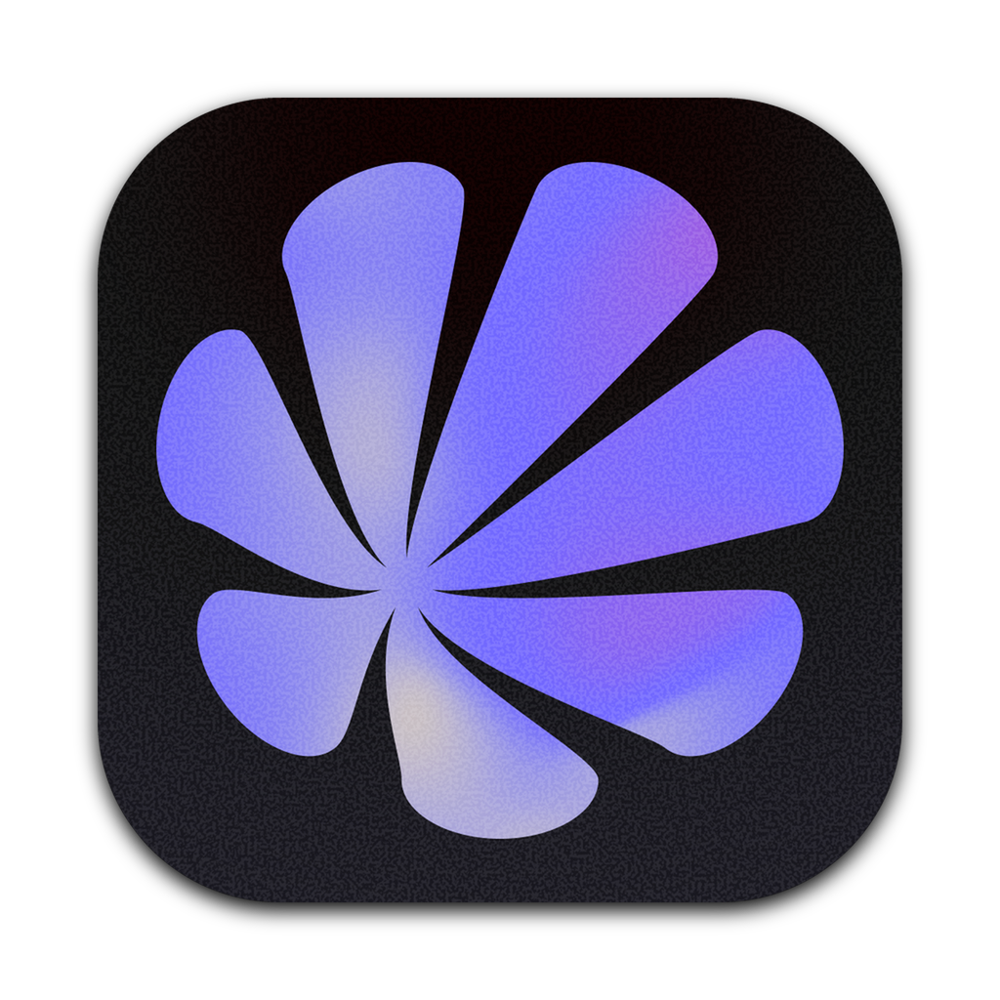
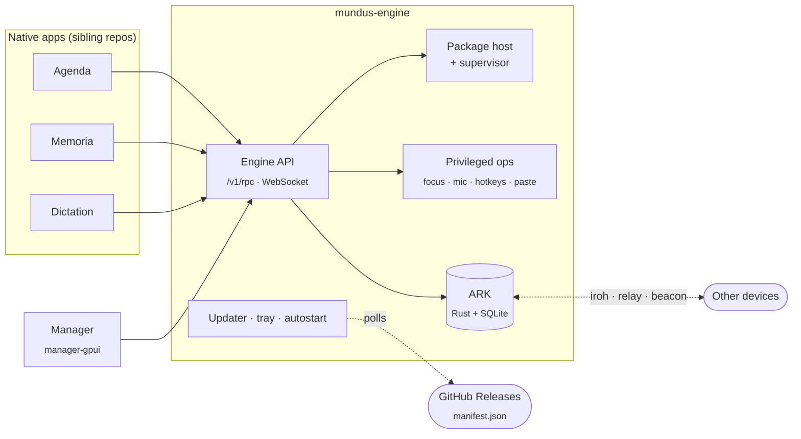
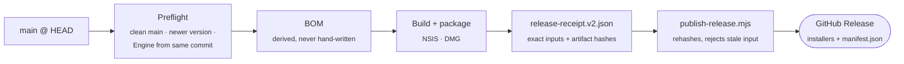

<div align="center">



# Mundus · Cortex

**The engine room of Mundus Desktop.**
One native Rust Engine with an embedded data core, a GPUI Manager, and the
pipeline that ships them to Windows and macOS every night.

<p>
  <a href="https://github.com/makekosmos/cortex/releases/latest"></a>
  <a href="https://github.com/makekosmos/cortex/actions/workflows/ci.yml"></a>
  <a href="https://github.com/makekosmos/cortex/actions/workflows/nightly-release.yml"></a>
  <a href="https://github.com/makekosmos/cortex/actions/workflows/installer-smoke.yml"></a>
</p>

<p>
  <a href="rust-toolchain.toml"></a>
  <a href="package.json"></a>
  <a href="manager-gpui/"></a>
  <a href="core/crates/ark-core/"></a>
  <a href="#download"></a>
  <a href="#download"></a>
</p>

<p>
  <a href="#download"><b>Download</b></a> ·
  <a href="#architecture"><b>Architecture</b></a> ·
  <a href="#quick-start"><b>Quick start</b></a> ·
  <a href="#checks"><b>Checks</b></a> ·
  <a href="#release-pipeline"><b>Release pipeline</b></a> ·
  <a href="#docs"><b>Docs</b></a>
</p>

</div>

---

## What lives here

Mundus Desktop is the Engine plus a set of native apps that sit on top of it.
This repository owns the Engine and everything around it.

|                  | Path                    | What it is                                                                                                                                                                               |
| ---------------- | ----------------------- | ---------------------------------------------------------------------------------------------------------------------------------------------------------------------------------------- |
| ⚙️ **Engine**    | `runtime/`              | `mundus-engine`: Engine API (`/v1/rpc`, WebSocket), package host and supervisor, focus and pomodoro, dictation, updater, tray, autostart. Privileged ops sit behind a one-time UAC grant |
| 🗄️ **ARK**       | `core/crates/ark-core/` | Rust + SQLite data core, hosted in-process by the Engine. Append-only schema, HLC clocks, p2p sync over iroh, relay, or LAN beacon                                                       |
| 🖥️ **Manager**   | `manager-gpui/`         | The GPUI control panel for the Engine. A separate Cargo workspace with its own `Cargo.lock`                                                                                              |
| 📦 **Packaging** | `desktop/`              | NSIS installer, macOS DMG, release BOM, manifest, and publishing                                                                                                                         |
| 🧪 **Gate**      | `scripts/`              | Local check planner (`check-*.mjs`), `dev.mjs`, Lefthook contracts                                                                                                                       |
| 📚 **Docs**      | `docs/`                 | Decisions and measurements (`docs/experiments/` is a measurement log, not rules)                                                                                                         |

The apps themselves live in sibling repositories. The Engine's Store installs
them from their GitHub Releases into `%LOCALAPPDATA%\Mundus\Apps`; the
installer does not bundle them.

| App          | Repository                                                              |
| ------------ | ----------------------------------------------------------------------- |
| 📅 Agenda    | [`makekosmos/agenda-gpui`](https://github.com/makekosmos/agenda-gpui)   |
| 🧠 Memoria   | [`makekosmos/memoria-gpui`](https://github.com/makekosmos/memoria-gpui) |
| 🎙️ Dictation | [`makekosmos/dictation`](https://github.com/makekosmos/dictation)       |

## Download

Nightly builds ship from `main` at 21:00 UTC.

| Platform   | Artifact                 | Status                                                                |
| ---------- | ------------------------ | --------------------------------------------------------------------- |
| 🪟 Windows | `Mundus-Setup-<ver>.exe` | Primary platform                                                      |
| 🍎 macOS   | `Mundus-<ver>.dmg`       | Built and checked in CI; the DMG is not yet signed or notarized       |
| 🐧 Linux   | none                     | Engine development only, see [`docs/linux-dev.md`](docs/linux-dev.md) |

**→ [Latest release](https://github.com/makekosmos/cortex/releases/latest)**

## Architecture



**One rule shapes the whole design:** apps never talk to the OS or the database
directly. The microphone, hotkeys, text insertion, focus blocking, API keys,
and every SQLite write belong to the Engine. If an app needs a new capability,
it gets a new Engine operation, never a bypass. See
[`docs/write-boundary.md`](docs/write-boundary.md) and
[`docs/repo-split-decisions.md`](docs/repo-split-decisions.md).

The shipped package is `mundus-engine` with ARK in-process, plus GPUI
components under `resources/components/<name>/`.

## Quick start

Requirements: Rust (pinned by `rust-toolchain.toml`) and Node with pnpm
`12.4.1`.

```sh
pnpm install                      # also installs the Lefthook hooks
pnpm run dev                      # build the Engine, run the Manager against it
pnpm run dev -- --engine-only     # only the Engine (cargo run -p engine)
pnpm run dev -- --data-dir DIR    # default: <tmp>/mundus-dev, shared by both
```

<details>
<summary><b>Without the wrapper</b></summary>

```sh
MUNDUS_DATA_DIR=/tmp/mundus-dev cargo run -p engine
MUNDUS_DATA_DIR=/tmp/mundus-dev cargo run --manifest-path manager-gpui/Cargo.toml
```

`cargo run -p engine` works because the crate sets
`default-run = "mundus-engine"`. The Manager starts the Engine named by
`MUNDUS_ENGINE_PATH` if none is running.

</details>

> [!TIP]
> If an Engine is already healthy in the data dir, the Manager reuses it as is.
> After you change `runtime/`, stop the stale Engine first. Its `pid` is in
> `<data-dir>/engine.lock.json`.

> [!NOTE]
> The first build compiles several hundred crates and is slow. Later builds are
> incremental. For cache tuning, see
> [`docs/rust-build-cache.md`](docs/rust-build-cache.md).

## Checks

Hosted CI is the source of truth for merges. The local gate is not a copy of
CI: it also runs checks that CI does not.

| Where                   | What runs                                                                                                           |
| ----------------------- | ------------------------------------------------------------------------------------------------------------------- |
| **CI · Ubuntu**         | rustfmt for both workspaces, actionlint, `cargo deny check bans`, dependency pins, toolchain versions               |
| **CI · Windows, macOS** | Clippy with `-D warnings`, build, Engine tests via nextest, Manager Clippy/tests/build, macOS native helpers        |
| **Installer smoke**     | On installer PRs and before every nightly: builds the Windows installer, then installs, upgrades, and uninstalls it |
| **Local only**          | brand, source size, test skips, layout, oxlint, oxfmt, core pin, static tests, runtime staging                      |

```sh
pnpm run check             # full local gate (scripts/check-plan-commands.mjs)
pnpm run check:affected    # only checks selected by the diff
pnpm run check:plan        # print the plan: JSON on stdout, reasons on stderr
node scripts/quick-check.mjs   # tight edit → check loop for the crates you touched
pnpm run check:manager-gpui    # Manager fmt + Clippy + tests
```

The hooks install with `pnpm install` (recover with `pnpm run prepare`).
Pre-commit runs only the fast checks; pre-push runs the plan for the branch
diff. Passing runs are cached by tree hash, so a push right after
`pnpm run check` skips what already ran. Do not bypass the hooks with
`--no-verify`.

<details>
<summary><b>How the affected-check planner decides</b></summary>

The planner fails closed. Every mode diffs the revision under test against
`merge-base(HEAD, origin/main)`:

- **pre-commit** plans staged changes;
- **worktree** plans tracked and untracked changes on disk;
- **pre-push** plans the union of every pushed commit's diff against its own
  merge base, whether or not the remote ref exists.

A missing merge base, a shallow clone, a non-commit pushed object, or an empty
or malformed push record selects the full check. Checks always run on the
on-disk tree. If a pushed commit's tree differs from it, the hook says that it
certified the working tree, not those commits. The push is not blocked, and CI
covers the pushed commits.

Docs and isolated assets are a no-op, except documents that tests read as
contracts (`DOC_CONTRACTS` in `scripts/check-plan-manifest.mjs`), which select
the checks that read them. A `package.json` edit that only changes known
`"scripts"` entries selects the checks that run those scripts. Any other
manifest change, an unmapped script, or an unparseable revision selects the
full check, as do shared, lockfile, build, workflow, hook, and unknown changes.
Read the planner's `reasons` field to learn why it chose a full run.

Pre-commit runs only checks that finish in seconds. It defers Clippy, Rust
tests, runtime staging, and the Manager gate. A change that selects the full
check runs `pnpm run check:fast` instead (`scripts/check-plan-commit.mjs`).

Cheap local baseline: layout 0.108 s, source-size test 0.680 s, naming test
0.154 s.

</details>

<details>
<summary><b>Rust tests</b></summary>

The Rust gate runs every workspace library, integration, and Cortex binary test
through [cargo-nextest](https://nexte.st), one process per test
(`cargo install cargo-nextest --locked`; the version is pinned in
`.config/nextest.toml`). Doc-tests are off on library targets
(`doctest = false`) because the workspace has none. Clippy compiles the
elevated Windows service entrypoints, but unprivileged hooks do not run them;
library tests cover their logic.

Local dictation (whisper.cpp, Parakeet/ONNX) builds only with the
`engine/local-dictation` feature. `pnpm run clippy` enables it; CI and normal
builds do not.

</details>

## Release pipeline



A green CI run publishes nothing. The nightly workflow releases `main`. Never
change the version, create tags, or publish by hand unless someone explicitly
asks you to.

```sh
pnpm run test:release-bom                                     # BOM, receipt, preflight contracts
node desktop/scripts/release-preflight.mjs --platform win     # preflight only, before any compilation
node desktop/scripts/build-package-components.mjs             # stage GPUI components (Windows)
node desktop/scripts/build-desktop.mjs --platform win         # build + package + verify, writes a receipt
node desktop/scripts/build-desktop.mjs --platform win --dry-run
node desktop/scripts/publish-release.mjs --platform win \
  --receipt desktop/release/release-receipt.v2.json --dry-run # validate publish, no GitHub changes
```

<details>
<summary><b>BOM, manifest, and the updater feed</b></summary>

The release BOM (`desktop/scripts/release-bom.mjs`) is derived from the checkout
at HEAD: commit, release version, pnpm/Node/Rust pins, target, and Engine API.

Each release carries one release document next to the installers:
`manifest.json` (`desktop/scripts/release-manifest.mjs`, schema
`mundus-release-manifest` v1). It holds the product version, the source
commit, toolchain, and Engine API, and a `platforms` map (`win`, `mac`; `linux`
reserved) with each installer's `file`, `url`, `size`, and `sha512`. The
Windows job creates it; the macOS publish merges its entry in.

The Engine updater (`runtime/src/updater/`) reads
`…/releases/latest/download/manifest.json`, and the nightly planner takes its
baseline from `source.commit`. During the dual-publish window
(`DUAL_PUBLISH_LEGACY_FEEDS = true`, Rust `LEGACY_FEED_FALLBACK = true`), the
release also carries `latest.yml`, `latest-mac.yml`, and `release-bom.v2.json`,
all rendered from the same manifest. Cutover flips both flags to `false`.

The Windows installer is a standalone NSIS script
(`desktop/build/installer.nsi`) compiled by `makensis`. The build downloads the
pinned NSIS bundle when `MUNDUS_NSIS_DIR` is unset. It writes
`release/release-provenance.json` and, atomically,
`release/release-receipt.v2.json`. `publish-release.mjs` consumes only that
receipt. It never builds or packages, and it re-derives the BOM from HEAD, so it
rejects a receipt from any other commit. Signing secrets are never read by the
BOM validator or the provenance emitter.

`pnpm --dir desktop run build` runs the whole release build in one go.

</details>

## House rules

- **Dead code goes immediately**, along with tests that only cover it. No
  `#[allow(dead_code)]`. `unwrap_used` and `unreachable` are `deny` in
  `[workspace.lints]`.
- **Files stay small:** more than 300 lines warns, more than 500 fails
  (`scripts/check-source-size.mjs`).
- **No silent skips:** no `#[ignore]` without a reason, and no test that
  "passes" through an early `return`.
- **The ARK schema only grows.** No destructive migrations. Every write to
  synced data bumps the sync version vector.
- **The product is Mundus.** `pnpm run check:brand` guards legacy names
  ([`docs/brand-legacy-identifiers.md`](docs/brand-legacy-identifiers.md)).
- **One gpui version.** The Manager pins the same `gpui` as Agenda, Memoria,
  and Dictation. Bump them together.

The full rule set for contributors and agents is in [`AGENTS.md`](AGENTS.md).

## Docs

| Topic                     | Doc                                                              |
| ------------------------- | ---------------------------------------------------------------- |
| ARK data core             | [`docs/ark-core.md`](docs/ark-core.md)                           |
| Sync: iroh, relay, beacon | [`docs/sync.md`](docs/sync.md)                                   |
| Write boundary            | [`docs/write-boundary.md`](docs/write-boundary.md)               |
| Focus and pomodoro        | [`docs/focus.md`](docs/focus.md)                                 |
| Dictation dev loop        | [`docs/dictation-dev.md`](docs/dictation-dev.md)                 |
| ONNX Runtime              | [`docs/onnxruntime.md`](docs/onnxruntime.md)                     |
| Linux development         | [`docs/linux-dev.md`](docs/linux-dev.md)                         |
| macOS package workers     | [`docs/macos-package-workers.md`](docs/macos-package-workers.md) |
| Build cache               | [`docs/rust-build-cache.md`](docs/rust-build-cache.md)           |
| Repo split decisions      | [`docs/repo-split-decisions.md`](docs/repo-split-decisions.md)   |
| Packaging and releases    | [`desktop/DEV.md`](desktop/DEV.md)                               |
| Manager                   | [`manager-gpui/README.md`](manager-gpui/README.md)               |
