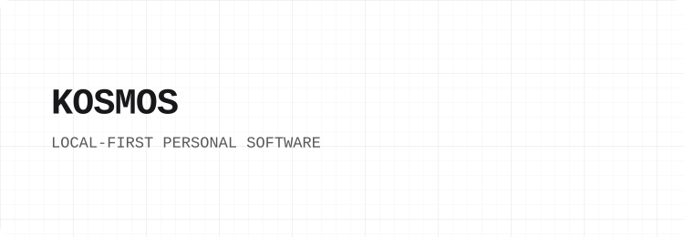
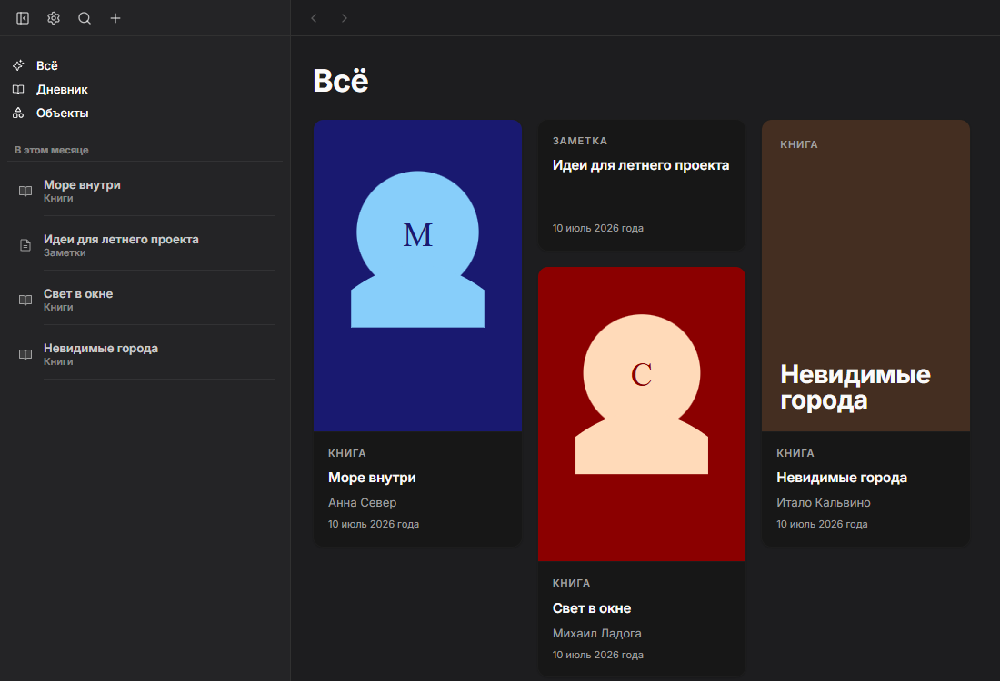
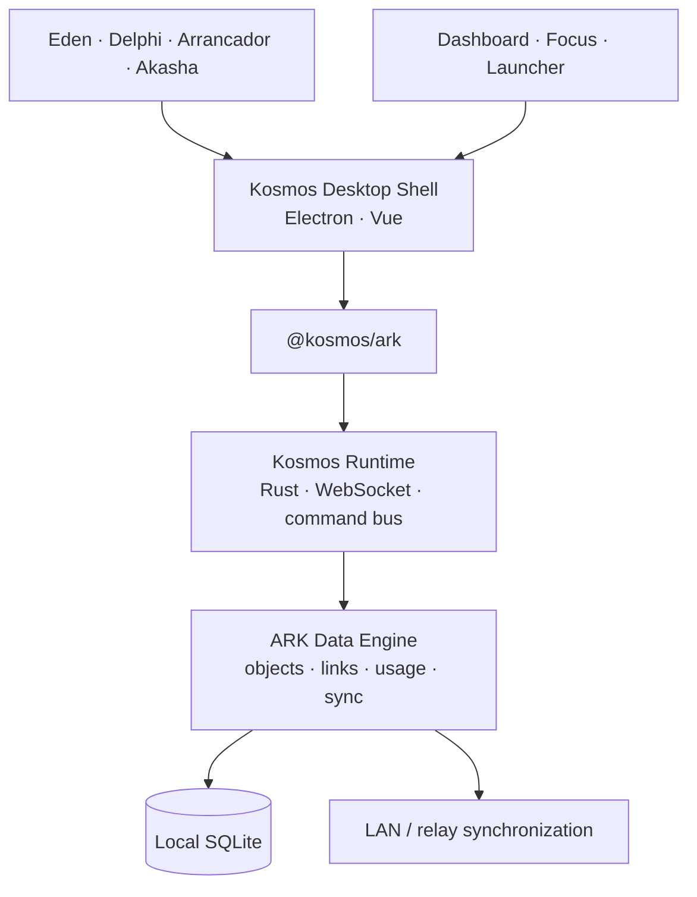

<p align="center">
  <picture>
    <source media="(prefers-color-scheme: dark)" srcset=".github/readme/header-dark.svg">
    
  </picture>
</p>

<p align="center"><strong>One data core. Many focused tools. No cloud required.</strong></p>

<p align="center">
  <a href="https://github.com/makekosmos/core"></a>
  
  
</p>

<p align="center">
  <a href="https://github.com/makekosmos/docs">Documentation</a> ·
  <a href="https://github.com/makekosmos/docs/blob/main/concepts/architecture.md">Architecture</a> ·
  <a href="./crates/ark-core/README.md">ARK</a> ·
  <a href="#development">Development</a>
</p>

## What is Kosmos?

Kosmos is a **local-first personal software system for Windows**. At its center is **ARK**, a shared Rust + SQLite data runtime for typed objects, links, activity data, and synchronization. Around it are focused tools for notes, tasks, games, reading, focus, and personal analytics.

The UI is replaceable; the data contract is not. Applications do not own isolated databases and do not write directly to SQLite. They communicate with ARK through the same narrow SDK, so a note, task, game, or usage session can remain useful outside the interface that created it.

<p align="center">
  
</p>

## Principles

- **Local-first** — the complete working dataset lives on the device; the network is optional.
- **One canonical runtime** — ARK owns persistence, object contracts, links, usage data, and sync.
- **Focused clients** — each app solves one workflow instead of becoming another silo.
- **Replaceable interfaces** — desktop apps, future native clients, CLI tools, and projections share stable contracts.
- **Auditable changes** — substantial work follows a spec → evidence → verification proof loop.

## Architecture



The Electron renderer never opens SQLite. Cortex talks to ARK through
`@kosmos/ark`; ARK remains the canonical owner of data and sync state.

## Surfaces

| Surface          | Role                                                         | State     |
| ---------------- | ------------------------------------------------------------ | --------- |
| **Kosmos Shell** | Launcher, extension host, settings, Dashboard, Focus Session | Active    |
| **Eden**         | Notes, journal, and typed personal objects                   | Active    |
| **Delphi**       | Tasks and inbox workflows                                    | Active    |
| **Arrancador**   | Game library, playtime, backups, and `game_obj` integration  | Incubator |
| **Akasha**       | Continuous EPUB reader                                       | Incubator |
| **ARK**          | Shared typed-data runtime, local storage, usage, and sync    | Core      |

## Stack

<p>
  
  
  
  
  
  
</p>

- **Data:** Rust, SQLite, FTS5, Hybrid Logical Clock, LAN/relay sync
- **Desktop:** Electron, Vue, TypeScript, Vite
- **Design:** `@kosmos/visuals`, shared OKLCH tokens and desktop primitives
- **Quality:** Playwright, Vitest, oxlint, oxfmt, proof-loop evidence

## Repository boundary

```text
core/ark/              ARK storage engine, schema, sync and RPC sidecar
```

Desktop, Manager, runtime supervisor and native Windows services live in
[`makekosmos/cortex`](https://github.com/makekosmos/cortex). The TypeScript
SDK and visuals package are maintained in `arca-sdk` and `imago`.

## Development

### Requirements

- Windows 10/11
- [Bun](https://bun.sh/) 1.3.5+
- stable [Rust](https://www.rust-lang.org/tools/install) toolchain
- Node.js 20+
- PowerShell 7+
- `cargo-nextest`, `cargo-shear`, and `cargo-deny` for repository quality gates

```powershell
git clone https://github.com/makekosmos/core.git
cd core
bun install

# Check the ARK storage engine
cargo check -p ark-core
```

Useful repository checks:

```powershell
bun run ark:guard:writes
bun run ark:smoke
cargo test -p ark-core
cargo fmt --check
cargo clippy --workspace --all-targets --all-features -- -D warnings
cargo deny check advisories bans sources
```

The local/CI Clippy gate keeps `-D warnings`; eight existing noisy lint
categories are explicitly baselined in `lefthook.yml` and CI until cleaned up.

`bun install` installs Lefthook hooks. Pre-commit runs staged-file checks and
fast Rust validation; pre-push runs the full Rust, dependency, and source-size
checks. CI is the enforceable superset.

Read the [getting-started guide](https://github.com/makekosmos/docs/blob/main/guide/getting-started.md) before
changing ARK or sync. Desktop development happens in
[`makekosmos/cortex`](https://github.com/makekosmos/cortex).
