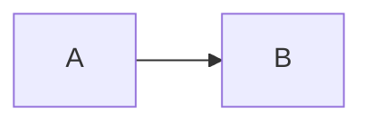

# Kosmos docs site

VitePress-сайт документации Kosmos. **Источник правды** для всех правил, инструкций и контекста — `docs-site/**/*.md`.

## Поток источника правды

```
docs-site/**/*.md         (источник правды, правишь только это)
        │
        │  bun run docs:sync
        ▼
        ├─ AGENTS.md                       (корень)
        ├─ CLAUDE.md                       (корень)
        ├─ apps/eden/AGENTS.md, apps/eden/ts/AGENTS.md
        ├─ mobile/delphi/AGENTS.md
        ├─ crates/ark-core/AGENTS.md
        └─ docs-site/public/llms.txt       (полный inline-текст для агентов через WebFetch)
```

**Никогда** не редактируй файлы, помеченные `<!-- AUTO-GENERATED -->`. Они будут перезаписаны следующим `docs:sync`.

## Команды

Из корня репо:

```powershell
bun run docs:dev        # локальный dev-сервер (http://localhost:5173) с hot reload
bun run docs:sync       # регенерация AGENTS.md / CLAUDE.md / llms.txt из docs-site/
bun run docs:build      # docs:sync + статическая сборка в docs-site/.vitepress/dist
bun run docs:preview    # превью собранного сайта
```

`docs:build` автоматически вызывает `docs:sync` перед сборкой — гарантия что сгенерированные файлы не отстают.

## Структура

```
docs-site/
├─ index.md                  # home (hero + features)
├─ guide/                    # getting-started, layout, tooling, workflow
├─ concepts/                 # архитектура, sync, write-boundary, proof-loop, …
├─ apps/                     # по странице на каждое приложение
├─ packages/                 # по странице на каждый пакет
├─ services/                 # usage-tracker
├─ reference/                # rules, smoke-matrix, decisions, glossary, commands
├─ agents/                   # ⭐ старт для AI-агента, чек-листы, запреты, шаблоны
├─ public/
│  └─ llms.txt               # автогенерация: полный inline-текст для агентов
└─ .vitepress/
   ├─ config.ts              # nav, sidebar, search, тема
   └─ theme/                 # кастомная тема под kosmos-visuals токены
```

## Что куда добавлять

| Хочу добавить…                           | Куда                                                                              |
| ---------------------------------------- | --------------------------------------------------------------------------------- |
| Новое правило (запрет, требование)       | `docs-site/agents/forbidden.md` или `docs-site/reference/rules.md`                |
| Новый чек-лист для области               | `docs-site/agents/checklists.md`                                                  |
| Новый концепт (sync, miration, протокол) | `docs-site/concepts/<name>.md`                                                    |
| Информацию о существующем приложении     | `docs-site/apps/<name>.md`                                                        |
| Информацию о существующем пакете         | `docs-site/packages/<name>.md`                                                    |
| ADR — архитектурное решение              | `docs/<DECISION>.md` (полный текст) + ссылка в `docs-site/reference/decisions.md` |

После любой правки → `bun run docs:sync` → коммит.

## Тема

Кастомная тема в `.vitepress/theme/custom.css` использует OKLCH-переменные из `packages/visuals/theme/css-variables.css`. При смене дизайн-токенов в `@kosmos/visuals` отрази их и здесь.

## Mermaid + pan/zoom

Диаграммы в любой `.md`:

````

````

Все mermaid-диаграммы автоматически получают pan/zoom (`svg-pan-zoom`): колесо — zoom, drag — pan, двойной клик — reset.
