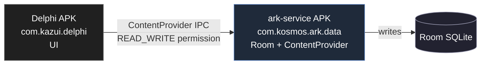

# ark-service — Android data provider

- **Path**: `mobile/ark-service`
- **Стек**: Kotlin / Gradle / Android (`com.android.application`)
- **Package**: `com.kosmos.ark.data`

::: warning Не путать с desktop-стеком
Это **отдельная APK** для Android, которая хранит данные **Android-приложения** Delphi (`mobile/delphi`, `com.kazui.delphi`) через свой Room SQLite и отдаёт их через ContentProvider. Это **не** «JVM service surface» вокруг `ark-core` Rust runtime — никакого UniFFI/FFI здесь нет, чистый Room.
:::

## Зачем

Android Delphi (`mobile/delphi`) и `ark-service` — это **две APK одного продукта**, связанные через signature-permission ContentProvider:



То есть **на Android** Delphi не владеет своими данными — он стучится в `ark-service` через `com.kosmos.ark.data` ContentProvider. Если `ark-service` не установлен — Delphi показывает экран «Установите ark-service для работы Delphi» (см. `mobile/delphi/.../NavGraph.kt:140`).

Это **зеркалит desktop-архитектуру** (Electron apps → ark-core-rpc), но в Android-IPC механизме и с Room вместо Rust runtime.

## Что внутри

Чистое Android-приложение:

- `ArkDatabase.kt` — Room database.
- DAO: `AreaDao`, `ProjectDao`, `TodoDao`, `NoteDao`, `HeadingDao`, `TagDao`, `ChecklistItemDao` — Things-clone модель данных.
- `ArkDataProvider.kt` — ContentProvider, expose Room через IPC.
- `ArkDataApp.kt` + Hilt — DI.
- Permission `com.kosmos.ark.data.READ_WRITE` с `protectionLevel="signature"` — доступ только для APK, подписанных тем же ключом (то есть только сам Delphi).

## Сборка

```powershell
cd apps/ark-service
.\gradlew build
```

Запускается отдельно от Android Delphi. Для работы Android Delphi нужно установить обе APK на устройство.

## Отношения с desktop ARK

Никаких прямых. **`ark-service` использует свою отдельную Room SQLite**, не общую `ark.db` файл с desktop. Sync между Android и desktop **сейчас не работает** — это две независимые data-ownership зоны.

## Будущая миграция

Долгосрочный план — заменить `ark-service` Room-стек на **UniFFI-binding'и от `ark-core`**:

- `ark-core` уже экспортирует UniFFI-фасад (`crates/ark-core/rust/src/ffi.rs`).
- В перспективе Android Delphi сможет напрямую использовать `ark-core` через сгенерированные Kotlin-binding'и, без отдельной `ark-service` APK.
- Тогда desktop и Android заговорят с одним рантаймом, sync между платформами начнёт работать.

Пока миграция не сделана — `ark-service` остаётся в репо как **рабочий, но изолированный** Android-data-стек.

## Связанные документы

- `mobile/delphi/AGENTS.md` — Android-приложение Delphi, потребитель ContentProvider.
- [Архитектура](/concepts/architecture) — общая картина desktop ARK.
- [@kepler/ark](/packages/ark) — desktop TS-клиент к `ark-core-rpc` (аналог `ark-service` для desktop).
