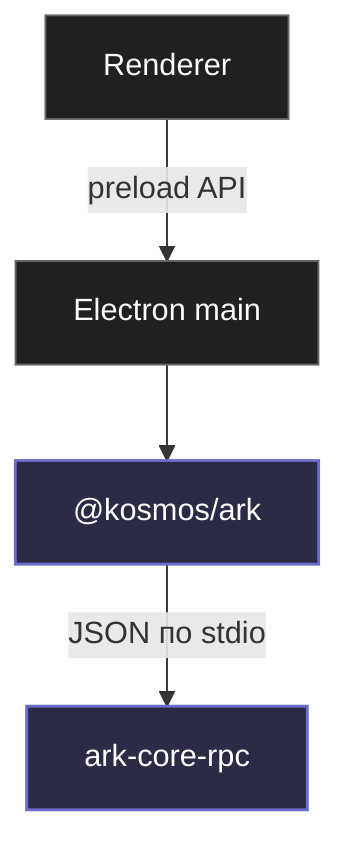

# Архитектура

## Высокоуровневая картина

- `Renderer` — Vue 3 Vapor в Electron-приложениях. Никакого SQLite, всё через preload IPC.
- `Electron main` — оркестрация, app-сервисы, единственный слой, который вызывает `@kosmos/ark`.
- `@kosmos/ark` — TS SDK к sidecar'у.
- `ark-core-rpc` — Rust runtime: SQLite, миграции, p2p sync.

## Слои

### Renderer

Vue 3.6 Vapor в Eden, Dashboard, Arrancador. Никогда не пишет напрямую в SQLite. Общается с Electron main через preload API.

Использует общие UI-примитивы из `@kosmos/visuals`: `Sidebar`, `Titlebar`, `TitlebarHistoryControls`, `DesktopChrome`, `DesktopContentSurface`, `CommandPalette`, `StatusDot`, `TodoRow`, `GamePosterCard`, `QuickEntryPanel`, `CustomCaret`.

### Electron main

Оркестрирует приложение, держит IPC, владеет sidecar-процессом. **Единственный** слой, который вызывает `@kosmos/ark`. Renderer его не видит — он работает через `window.<appName>Api` (`window.dashboardApi`, `window.arrancador`, и т.п.).

### @kosmos/ark

Канонический TS-клиент к `ark-core-rpc`. Два режима работы:

- **self-managed sidecar** — `ArkClient` сам спавнит и владеет процессом `ark-core-rpc.exe`. Используется когда приложение единственный потребитель.
- **injected sidecar** — sidecar уже владеется другим слоем (например, `apps/delphi/ts/electron/sidecar.ts`), `ArkClient` получает `requestFn` / `onEventFn`. Используется когда внутри Electron-приложения несколько сервисов делят один sidecar.

См. [@kosmos/ark](/packages/kosmos-ark).

### ark-core-rpc (Rust)

Канонический бинарь рантайма. Принимает newline-delimited JSON со stdin, пишет ответы и события в stdout. Внутри:

| Файл | Что делает |
|---|---|
| `main.rs` | stdin/stdout цикл, диспетчер операций |
| `db.rs` | SQLite CRUD, миграции, sync storage adapter |
| `schema.rs` | DDL — `CREATE TABLE IF NOT EXISTS` и индексы |
| `types.rs` | shared entities и sync payloads |
| `protocol.rs` | wire-протокол sync (фреймы) |
| `hlc.rs` | Hybrid Logical Clock |
| `sync_server.rs`, `sync_client.rs` | WebSocket sync |
| `beacon.rs` | UDP discovery в LAN |
| `relay_transport.rs`, `relay_sync.rs` | relay-bridge поверх sync |
| `mesh.rs` | координация LAN + relay |
| `host.rs`, `net.rs` | фильтрация hostname и routable addresses |
| `ffi.rs` | UniFFI facade для Android / Swift |

### SQLite

Внутри одна база на пространство данных (`space`), путь типа `%APPDATA%\Kosmos\spaces\<spaceId>\ark.db` (или `%APPDATA%\Kosmos\ark.db` для usage-tracker).

Схема — additive: `init_schema` мигрирует существующие БД на месте через `CREATE TABLE IF NOT EXISTS` без перезаписи файла.

См. [Модель данных ARK](/concepts/ark-objects).

## Принципы

### 1. Local-first

Каждое устройство имеет полную копию своих данных. Сеть нужна для синхронизации, не для чтения. Приложение работает offline.

### 2. Single shared runtime

ARK владеет схемой, объектами, usage-данными, sync-протоколом. Приложения — тонкие оболочки. Если ты пишешь много логики работы с данными внутри приложения — ты, скорее всего, ошибаешься; этот код должен быть в ARK.

### 3. Narrow contract

Приложения говорят с ARK **только** через `@kosmos/ark` (TS) или `ark_core::db` (Rust-writers). Прямые SQL writes в app services запрещены. См. [Граница записи](/concepts/write-boundary).

### 4. Auditable changes

Substantial-правки проходят через proof loop с явными AC и evidence. См. [Proof loop](/concepts/proof-loop).

### 5. Sync-aware

Любая запись в синхронизируемую сущность обязана обновлять `lan_sync.version_vector` через runtime. Прямой SQL `INSERT` в обход — ломает CRDT-merge на пирах. Если по веской причине пишешь напрямую (Rust direct writer вроде `usage-tracker`) — используй `ark_core::db::bump_sync_version_vector`.

## Компонентная карта

| Кусок | Где | Тип | Роль |
|---|---|---|---|
| ark-core | `packages/ark-core/rust` | Rust crate + бинарь | runtime данных |
| @kosmos/ark | `packages/kosmos-ark` | TS SDK | клиент к sidecar |
| ark-relay-server | `services/ark-relay-server` | Rust server | WebSocket relay (NAT-обход p2p sync) |
| kosmos-visuals | `packages/kosmos-visuals` | TS + Vue | дизайн-система |
| Electron apps | `apps/{eden,delphi,arrancador,dashboard}` | TS + Electron | продуктовые оболочки |
| ark-service | `apps/ark-service` | Kotlin + Room | Android ContentProvider, держит данные Android Delphi (`apps/delphi/kotlin`). Изолирован от desktop ARK, ждёт миграции на UniFFI |
| usage-tracker | `services/usage-tracker` | Rust | захват usage data → ARK |
