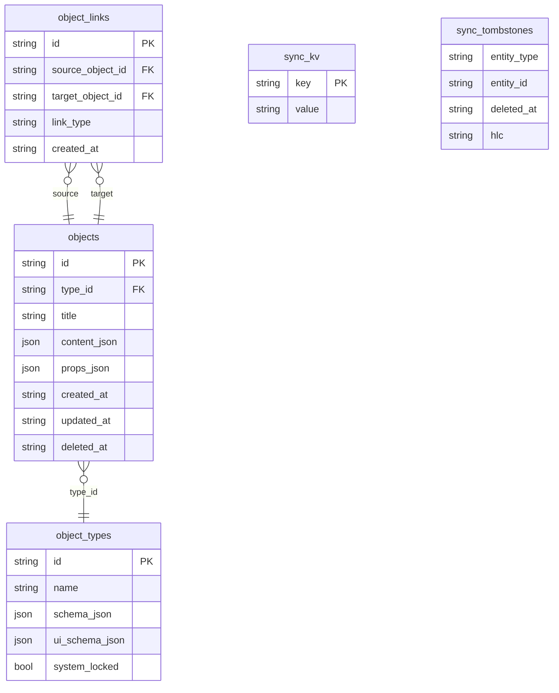

# Модель данных ARK

ARK хранит данные приложений как **универсальные объекты** в SQLite. Каждый объект имеет тип (`object_types`), JSON-полезную нагрузку и опциональные связи (`object_links`). Кроме объектов ARK хранит **usage data** (тяжёлый stream сессий использования) и **sync metadata**.

## Таблицы

ARK SQLite на 2026-04-16 содержит:

| Группа | Таблицы | Назначение |
|---|---|---|
| **Generic object model** | `object_types`, `objects`, `object_links` | Универсальные объекты приложений |
| **Usage tracking** | `tracked_apps`, `usage_sessions`, `usage_events` | Сессии использования (windows tracker) |
| **Legacy planning** | `todos`, `projects`, `areas`, `tags`, `headings` | Старая модель задач (Delphi мигрирует в object model) |
| **Sync metadata** | `sync_kv`, `sync_tombstones` | Версионные векторы, HLC, tombstones для delete propagation |

**Новые app-domain данные должны идти в generic object model**, если только это не высокообъёмные analytics/usage-данные.



## Generic object model

### `object_types`

Описывает зарегистрированный тип объекта.

```ts
{
  id: 'task_obj',
  name: 'Task',
  schemaJson: '{}',          // JSON Schema (опционально)
  uiSchemaJson: '{}',        // UI hint
  createdAt: '...',
  updatedAt: '...',
  systemLocked: false,       // системные типы нельзя редактировать
}
```

### `objects`

Сам объект. Идентификация и контент.

```ts
{
  id: 'task-1',
  typeId: 'task_obj',
  title: 'Draft plan',
  contentJson: { body: '...' },          // основное тело
  propsJson: { status: 'open', billable: false, price: null }, // app-specific properties
  createdAt: '...',
  updatedAt: '...',
  deletedAt: null,
}
```

### `object_links`

Связи между объектами (заметка ↔ задача, задача ↔ игра и т.п.).

```ts
{
  id: 'link-1',
  sourceObjectId: 'task-1',
  targetObjectId: 'note-1',
  linkType: 'related',
  createdAt: '...',
}
```

## Известные типы объектов

| `typeId` | Кто пишет | Что значит |
|---|---|---|
| `note_obj` | Eden | заметка (дневник, typed note) |
| `task_obj` | Delphi | задача (после миграции legacy todos) |
| `game_obj` | Arrancador | запись об игре |
| `time_entry_obj` | Horologion | запись отрезка времени (start/end), pomodoro-сегменты, ручные записи |
| `tag_obj` <span class="kbadge accent">WIP</span> | **shared** (Delphi + Horologion) | общий тег (`title` = имя, `propsJson.color` = OKLCH-цвет). Связи через `object_links` с `linkType='tagged'`. |

Каждое приложение может зарегистрировать **custom object type** (например, для специализированных typed-notes Eden или для категорий задач Delphi). Custom types — это часть продуктового домена приложения.

### Object links — конвенции `linkType`

| `linkType` | source → target | Кто использует |
|---|---|---|
| `tagged` | `<any>` → `tag_obj` | Все приложения — для пометки тегом |
| `for-task` | `time_entry_obj` → `task_obj` | Horologion — привязка записи к задаче |
| `related` | универсальное | любая семантически связанная пара |

### Schema для `time_entry_obj`

```ts
{
  id: 'te-...',
  typeId: 'time_entry_obj',
  title: 'Описание чем занимался',
  contentJson: { /* зарезервировано */ },
  propsJson: {
    startedAt: '2026-05-12T10:00:00Z',
    endedAt:   '2026-05-12T10:25:00Z',   // null пока тикает
    billable?: boolean,                   // флаг для агрегации в Delphi billing
    taskId?: string | null,               // ID `task_obj` — связь задачи и записи времени
    taskTitle?: string | null,            // snapshot title задачи на момент записи
    source: 'manual' | 'imported',        // ручная запись или импорт из usage-tracker
  },
}
```

::: info Pomodoro не маркирует записи
`kind` / `pomodoroSessionId` сняты. Pomodoro — чисто UI-фича: создаёт обычные
`time_entry_obj` через тот же IPC, что и ручной секундомер. На finish work-сегмента
с N выбранными задачами anchor-запись удаляется и создаются N равных split-entries.
Опционально (`pomodoroSettings.trackBreaksAsRest`) break-фазы пишут entry с
title «Отдых».
:::

### Schema для `tag_obj`

```ts
{
  id: 'tag-...',
  typeId: 'tag_obj',
  title: 'учёба',
  propsJson: {
    color: 'oklch(0.7 0.15 250)',
    description?: string,
  },
}
```

Подробнее про использование — см. [Horologion](/apps/horologion).

## Usage data

Отдельный тяжёлый stream. Источник правды — `services/usage-tracker`, который пишет напрямую в SQLite (через `ark_core::db` хелперы с обновлением `lan_sync.version_vector`).

### `tracked_apps`

Известные приложению exe / процессы:

```rust
TrackedApp {
  id: String,
  platform: 'windows',
  exe_path: 'C:/Games/Demo/demo.exe',
  normalized_exe_path: 'c:/games/demo/demo.exe',
  process_name: 'demo.exe',
  display_name: 'Demo',
  publisher: Option<String>,
  icon_ref: Option<String>,
  first_seen_at: '...',
  last_seen_at: '...',
}
```

### `usage_sessions`

Агрегированные сессии (foreground time):

```rust
UsageSession { id, tracked_app_id, started_at, ended_at, duration_ms, ... }
```

### `usage_events`

Мелкозернистые события (window switches, idle переходы).

## Sync metadata

| Таблица | Что хранит |
|---|---|
| `sync_kv` | произвольный key/value (HLC последнего apply, версии векторов, peer ids) |
| `sync_tombstones` | durable tombstones для propagation удалений |

`lan_sync.version_vector` — это запись в `sync_kv` под фиксированным ключом, обновляется на каждой записи в синхронизируемую сущность.

## TypeScript API через `@kosmos/ark`

```ts
// CRUD объектов
await ark.objects.upsert({
  id: 'task-1', typeId: 'task_obj', title: 'Draft plan',
  contentJson: { body: '' }, propsJson: { status: 'open' },
  createdAt: now, updatedAt: now, deletedAt: null,
});
const t = await ark.objects.get('task-1');
const all = await ark.objects.list();
const tasks = await ark.objects.listByType('task_obj');
const many = await ark.objects.getMany(['task-1', 'note-1']);
const matches = await ark.objects.search('plan');
await ark.objects.delete('task-1');

// Object types
await ark.objectTypes.upsert({
  id: 'task_obj', name: 'Task',
  schemaJson: '{}', uiSchemaJson: '{}',
  createdAt: now, updatedAt: now, systemLocked: false,
});

// Links
await ark.links.upsert({
  id: 'link-1', sourceObjectId: 'task-1', targetObjectId: 'note-1',
  linkType: 'related', createdAt: now,
});

// Usage
const usage = await ark.usage.loadAll();
const recent = await ark.usage.processes.recent(10);
const found = await ark.usage.processes.search('demo', 10);
const summary = await ark.usage.gamePlaytime.summary({
  bindings: [{ gameId, gameName, matchType: 'exe_path', matchValue: 'C:/...' }],
  rangeStart: '2026-04-01',
  rangeEnd: '2026-04-30',
});
```

`listByType` и `getMany` — реальные `ark-core-rpc` query-операции, не SDK-side фильтрация над `list()`.

## Runtime query endpoints

ARK предоставляет специализированные query-операции на стороне Rust:

- `list_objects_by_type` — выборка по типу
- `get_objects_by_ids` — bulk-получение
- `list_recent_usage_processes` — последние процессы
- `search_usage_processes` — поиск по подстроке
- `get_usage_game_playtime_summary` — агрегация playtime для биндингов game ↔ exe

Поиск `objects.search('...')` использует SQLite **FTS5** когда доступен и fallback на in-memory matching, когда FTS не работает.

## Sync state и tombstones

Любая запись через `ark-core-rpc` автоматически обновляет `lan_sync.version_vector` и записывает durable tombstone в `sync_tombstones` при удалении. Прямой SQL `INSERT` / `DELETE` ломает это — реплики на других устройствах не увидят изменение.

Если ты пишешь Rust direct writer (как `usage-tracker`) — **обязан** вызывать `ark_core::db::bump_sync_version_vector` после каждой записи.

## Канонический референс

- `packages/ark-core/README.md` — обзор runtime.
- `packages/ark-core/rust/src/schema.rs` — DDL.
- `packages/ark-core/rust/src/db.rs` — CRUD и миграции.
- `packages/ark-core/rust/src/types.rs` — сущности и payloads.
