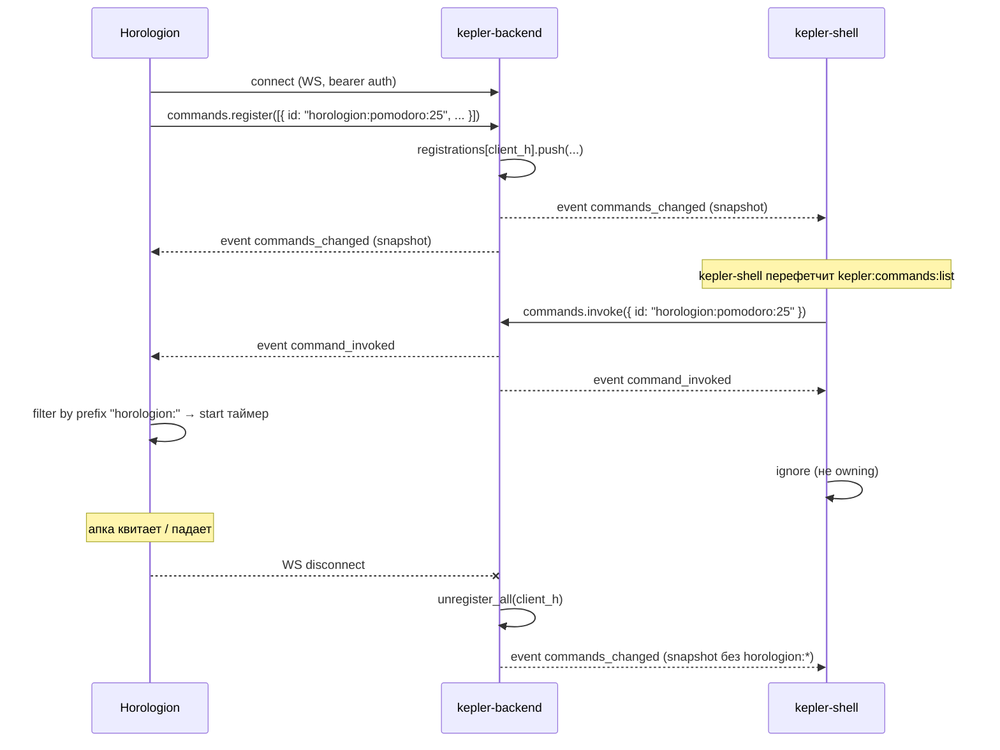

# Command bus

Command bus — communication primitive в Kepler, который позволяет launcher'у (kepler-shell) показывать и invoke'ать «ручки» (action commands) running апок без extension architecture. Апки остаются standalone .exe Electron-приложениями, но публикуют свои действия в shared registry через WS, и launcher merge'ит их со static open-commands в общий список.

## Архитектура: три слоя команд (V1 + V2, 2026-05-19)

После Phase 6.2 команды в launcher'е приходят из **трёх** независимых источников. Merge происходит в `shell/electron/main.ts → kepler:commands:list` IPC, дедуп по `id`:

| Слой                     | Источник                                                 | Видимость                     | Use case                                                                               |
| ------------------------ | -------------------------------------------------------- | ----------------------------- | -------------------------------------------------------------------------------------- |
| **A. Kepler-internal**   | `shell/electron/commands.ts` `COMMANDS[]`                | всегда                        | settings/dashboard/check-updates — это сам shell                                       |
| **B. Manifest-declared** | `extensions/<id>/manifest.json` `commands[]`             | пока extension установлен     | Entry points (Open Eden, Pomodoro, Open today) — declarative, не требует running state |
| **C. Runtime dynamic**   | `commands.register(...)` через WS из running extension'а | только пока extension запущен | State-aware actions (Stop pomodoro, Save current note)                                 |

Приоритет дедупа: A > B > C. Extension **не может** claim'нуть чужой namespace — manifest-declared команды автоматически префиксуются `${extension.id}:`, registry проверяет.

### Manifest schema

```ts
interface KextManifestCommand {
  id: string; // [a-z0-9:_-]+, полный id = `${manifest.id}:${cmd.id}`
  title: string; // RU label в launcher'е
  subtitle?: string; // подпись (default: extension.name)
  icon?: string; // относительный путь от extension dir
  route?: string; // hash-route для openExtension
  kind?: "app" | "command"; // UI plate (default: "command")
  mode?: "open" | "action"; // (default: "open")
}
```

`mode: "open"` — invoke вызывает `openExtension(extId, route)`. Покрывает entry points через deep-link route.

`mode: "action"` — invoke вызывает `arkClient.commands.invoke(fullId)` (dynamic action bus). Если extension не запущен — **auto-launch**: shell openExtension'ит, ждёт до 5 секунд пока mount + `commands.register` отработает с нужным id, потом dispatch'ит. См. `awaitExtensionCommand` в `main.ts`.

### Что было до и зачем рефактор

Раньше extension-команды зашивались в `shell/electron/commands.ts` как static `COMMANDS[]`. Минусы: shell coupled с extension internals, новая команда extension'а требовала правки shell, третьесторонние extension'ы не могли публиковать команды, uninstall не очищал launcher. Phase 6.2 — manifest = source of truth, `loadDeclaredCommands` в `extension-host.ts` строит registry на лету при каждом `kepler:commands:list`. `notifyCommandsChanged()` после install/uninstall/revert триггерит launcher refresh через `kepler:commands:updated`.

### Edge cases (cover'ятся в `tests/e2e/commands-architecture.spec.ts`)

- Extension не установлен → команд нет ни в одном слое.
- Extension удалён → re-scan manifests, команды исчезают через broadcast.
- Duplicate id между слоями → internal > manifest > dynamic priority.
- Невалидный icon path / id format → graceful skip с warning.
- Auto-launch timeout 5s → warning, hide launcher.
- Invoke unknown id → graceful warning, no crash.

## Цель

Сценарий: пользователь жмёт `Ctrl+Shift+K`, набирает «pomodoro 25», видит пункт «Pomodoro 25 min — Horologion», нажимает Enter. Horologion (если запущен) получает event и стартует таймер. Если Horologion не запущен — пункта в списке нет.

Это **не** RPC: invoker (kepler-shell) не получает ответа от handler'а (Horologion). Это broadcast события — fire-and-forget, идемпотентность на стороне апки.

## Архитектура

```text
                kepler-backend (Rust)
                  ┌──────────────────────────┐
                  │  CommandBus              │
                  │  ┌────────────────────┐  │
ws client #1 ───►─┤  │ HashMap<ClientId,  │  │
(Horologion)      │  │   Vec<Manifest>>   │  │
                  │  └────────────────────┘  │
ws client #2 ───►─┤  ┌────────────────────┐  │
(Eden)            │  │ broadcast::Sender  │──┼─►─ Changed | Invoked
                  │  └────────────────────┘  │
ws client #3 ───►─┤                          │
(kepler-shell)    └──────────────────────────┘
```

- **Registry per WS-connection.** Каждый WS клиент имеет свой список `CommandManifest`. На disconnect — auto-cleanup.
- **Broadcast.** Любое invoke / register / unregister рассылается всем подключённым (via `tokio::broadcast`). Owning client фильтрует по `id`.
- **Intercept в ws_server.** Операции `commands.*` не доходят до `ark-core-rpc` — `ws_server.rs` обрабатывает их прямо через `CommandBus`.

См. `services/kepler-backend/src/command_bus.rs`.

## WS Protocol

### Operations (client → server)

```text
commands.register({ commands: CommandManifest[] }) → { ok: true }
commands.unregister({ ids: string[] })             → { ok: true }
commands.list()                                    → { ok: true, data: { commands: CommandManifest[] } }
commands.invoke({ id: string, params?: object })   → { ok: true }   // async — handler работает через event
```

### Events (server → all clients, broadcast)

```text
{ event: "command_invoked",   id: string, params?: object, invokerClientId?: string }
{ event: "commands_changed",  commands: CommandManifest[] }
```

### CommandManifest (wire-формат)

```ts
interface CommandManifest {
  id: string; // глобально уникальный, например "horologion:pomodoro:25"
  title: string; // что показывать в launcher
  subtitle?: string; // обычно имя апки
  category: "open" | "action"; // 'action' — dynamic ручки апок; 'open' — static от kepler-shell
}
```

### CommandRecord (launcher-side, `shell/shared/ipc-types.ts`)

Static `COMMANDS` в shell + dynamic с backend merge'атся в единый список `CommandRecord`, который видит renderer. Поверх wire-`CommandManifest` добавлены два UI-поля:

```ts
interface CommandRecord {
  id: string;
  title: string;
  subtitle?: string;
  category: "open" | "action";
  /** UI-классификация плашки. 'app' → правый лейбл «Приложение».
      'command' → имя приложения + правый лейбл «Команда». */
  kind?: "app" | "command";
  /** Имя родительского приложения для command-плашек. */
  appName?: string;
  /** Resolved data-uri (PNG для extension'ов), undefined для builtin. */
  icon?: string;
}
```

Поля `kind` / `appName` живут **только** в shell registry и dynamic командах от extension'ов — backend wire-протокол их не описывает, чтобы не ломать обратную совместимость. Если dynamic команда приходит без `kind`, LauncherView обходится без правого лейбла. Поле `kind` важно для UI, а не для роутинга invoke'ов.

## Lifecycle



1. App connects к WS (kepler-mode `ArkClient`).
2. App регистрирует свои manifest'ы через `commands.register`.
3. Backend broadcast'ит `commands_changed` всем подписчикам.
4. kepler-shell перефетчит список (через `kepler:commands:list` IPC) — merge static + dynamic.
5. User invoke'ит → backend broadcast'ит `command_invoked`.
6. Owning апка обрабатывает (фильтрация по prefix `id`).
7. App disconnect → registry автоматически очищается → `commands_changed` снова рассылается.

## Dedup внутри клиента

`commands.register` дедупит по `id` last-write-wins. Если апка register'ит тот же `id` дважды — второй заменяет первый. Это позволяет update'ить title / subtitle без вызова `unregister`.

## Code refs

| Слой                 | Файл                                         | Что делает                                                                                                                                                                                                                                                                                                                          |
| -------------------- | -------------------------------------------- | ----------------------------------------------------------------------------------------------------------------------------------------------------------------------------------------------------------------------------------------------------------------------------------------------------------------------------------- |
| Backend registry     | `services/kepler-backend/src/command_bus.rs` | `CommandBus` структура (registrations, broadcast), unit-тесты                                                                                                                                                                                                                                                                       |
| Backend WS dispatch  | `services/kepler-backend/src/ws_server.rs`   | intercept `commands.*` operations, broadcast events                                                                                                                                                                                                                                                                                 |
| TS SDK               | `packages/ark/src/ark-client.ts`             | `ArkCommandsApi`: `register/unregister/list/invoke/onInvoked/onChanged`                                                                                                                                                                                                                                                             |
| Launcher merge       | `shell/electron/main.ts`                     | `kepler:commands:list` IPC = static `COMMANDS` ∪ `arkClient.commands.list()`                                                                                                                                                                                                                                                        |
| Launcher invoke      | `shell/electron/main.ts`                     | `kepler:commands:invoke` — static exec локально, dynamic — `arkClient.commands.invoke(id)`                                                                                                                                                                                                                                          |
| Static open-commands | `shell/electron/commands.ts`                 | `COMMANDS: InternalCommand[]` — open app tiles (Delphi / Horologion / Arrancador), builtin Kepler commands (Settings / Dashboard / Check updates), extension routes (`delphi:today`, `horologion:pomodoro`, …). Полный список — см. [Kepler → Static commands](/apps/kepler#static-commands-registry-в-shell-electron-commands-ts). |

## Examples

### Регистрация (Horologion при старте)

```ts
// apps/horologion/electron/main.ts
import { ArkClient } from "@kosmos/ark";

const client = new ArkClient({
  /* kepler-mode */
});
await client.start();

async function registerHorologionCommands() {
  await client.commands.register([
    {
      id: "horologion:pomodoro:25",
      title: "Pomodoro 25 min",
      subtitle: "Horologion",
      category: "action",
    },
    {
      id: "horologion:stopwatch:start",
      title: "Старт секундомера",
      subtitle: "Horologion",
      category: "action",
    },
  ]);
}
```

### Listening (handle на стороне апки)

```ts
const off = client.commands.onInvoked((e) => {
  if (!e.id.startsWith("horologion:")) return;
  switch (e.id) {
    case "horologion:pomodoro:25":
      pomodoro.start({ minutes: 25 });
      break;
    case "horologion:stopwatch:start":
      stopwatch.start();
      break;
  }
});

// unsubscribe при shutdown
app.on("before-quit", () => off());
```

### Invoke (от launcher через `@kosmos/ark`)

```ts
// shell/electron/main.ts (упрощённо)
await arkClient.commands.invoke("horologion:pomodoro:25");
```

### Listen на изменения списка (kepler-shell)

```ts
client.commands.onChanged(() => {
  // перефетчить и обновить UI launcher'а
  mainWindow.webContents.send("kepler:commands:updated");
});
```

## Race / edge cases

- **Invoke без registrant'а.** Если на момент invoke никто не зарегистрирован под этим `id` — broadcast уходит, никто не handle'ит. Silent drop. Это ожидаемо — например, апка успела disconnect'нуться между фетчем `list` и invoke. Launcher hide-ит окно в любом случае.
- **App crash в middle of handler.** Событие не retry'ится. Handler идёт идемпотентно или ловит свои ошибки. Backend не знает, что handler'у плохо.
- **Двойная register.** Last-write-wins по `id` внутри одного клиента. Между клиентами — конфликт `id` решается порядком регистрации (кто первый — тот и виден; повторная register с тем же `id` от другого клиента не вытесняет предыдущего, но добавит entry. Не используй pre-existing `id` из другой апки).
- **Static commands приоритет.** kepler-shell merge'ит так, что static `COMMANDS` (например `dashboard:open` / `settings:open`) **не** перебиваются dynamic'ом — апка не может зарегистрировать чужой `id` и притвориться launcher'ом. Конвенция: dynamic id содержит namespace апки.
- **Order.** Перечень не упорядочен между клиентами (`HashMap` iteration). Внутри одного клиента — insertion order сохраняется. Если нужен порядок в UI — сортируй на стороне launcher'а по `title`.

## Когда использовать command bus, а когда entity event

| Сценарий                         | Что использовать                                                                                          |
| -------------------------------- | --------------------------------------------------------------------------------------------------------- |
| «Покажи мне task с id X»         | ARK objects (get / list), не command bus                                                                  |
| «Создай новую заметку с title Y» | command bus (action `<app>:note:create`)                                                                  |
| «Запусти Pomodoro 25 минут»      | command bus (action `horologion:pomodoro:25`)                                                             |
| «Объект task-1 изменился»        | entity events (`onEntityChanged`)                                                                         |
| «Открой Delphi»                  | manifest-declared в `extensions/delphi/manifest.json` `commands[]` (`delphi:open` → `openExtension(...)`) |

Идея: command bus = императивный trigger для running апки. ARK objects = stateful data. Entity events = observation channel. Не путай.

## Связанные документы

- [Архитектура](/concepts/architecture) — общая картина.
- [Extension host](/concepts/extension-host) — Phase 4 foundation для in-shell extensions.
- [@kosmos/ark](/packages/ark) — TS SDK с `ArkCommandsApi`.
