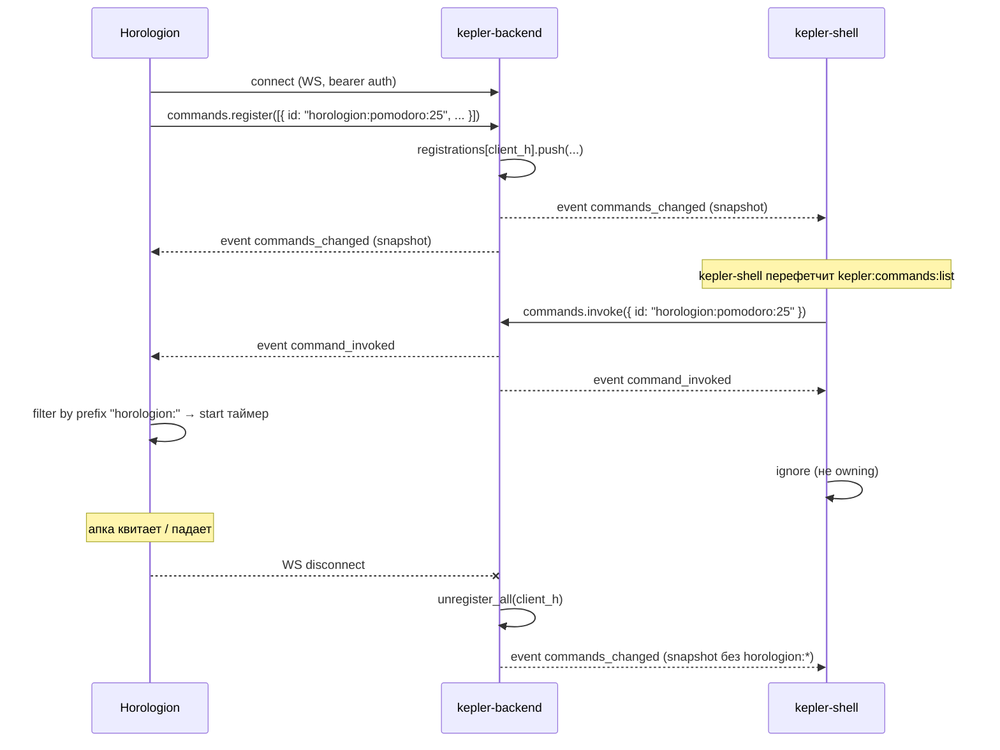

# Command bus

Command bus — communication primitive в Kepler, который позволяет launcher'у (kepler-shell) показывать и invoke'ать «ручки» (action commands) running апок без extension architecture. Апки остаются standalone .exe Electron-приложениями, но публикуют свои действия в shared registry через WS, и launcher merge'ит их со static open-commands в общий список.

## Цель

Сценарий: пользователь жмёт `Ctrl+Shift+K`, набирает «pomodoro 25», видит пункт «Pomodoro 25 min — Horologion», нажимает Enter. Horologion (если запущен) получает event и стартует таймер. Если Horologion не запущен — пункта в списке нет.

Это **не** RPC: invoker (kepler-shell) не получает ответа от handler'а (Horologion). Это broadcast события — fire-and-forget, идемпотентность на стороне апки.

## Архитектура

```text
                kepler-backend (Rust)
                  ┌──────────────────────────┐
                  │  CommandBus              │
                  │  ┌────────────────────┐  │
ws client #1 ───►─┤  │ HashMap<ClientId,  │  │
(Horologion)      │  │   Vec<Manifest>>   │  │
                  │  └────────────────────┘  │
ws client #2 ───►─┤  ┌────────────────────┐  │
(Eden)            │  │ broadcast::Sender  │──┼─►─ Changed | Invoked
                  │  └────────────────────┘  │
ws client #3 ───►─┤                          │
(kepler-shell)    └──────────────────────────┘
```

- **Registry per WS-connection.** Каждый WS клиент имеет свой список `CommandManifest`. На disconnect — auto-cleanup.
- **Broadcast.** Любое invoke / register / unregister рассылается всем подключённым (via `tokio::broadcast`). Owning client фильтрует по `id`.
- **Intercept в ws_server.** Операции `commands.*` не доходят до `ark-core-rpc` — `ws_server.rs` обрабатывает их прямо через `CommandBus`.

См. `services/kepler-backend/src/command_bus.rs`.

## WS Protocol

### Operations (client → server)

```text
commands.register({ commands: CommandManifest[] }) → { ok: true }
commands.unregister({ ids: string[] })             → { ok: true }
commands.list()                                    → { ok: true, data: { commands: CommandManifest[] } }
commands.invoke({ id: string, params?: object })   → { ok: true }   // async — handler работает через event
```

### Events (server → all clients, broadcast)

```text
{ event: "command_invoked",   id: string, params?: object, invokerClientId?: string }
{ event: "commands_changed",  commands: CommandManifest[] }
```

### CommandManifest

```ts
interface CommandManifest {
  id: string                              // глобально уникальный, например "horologion:pomodoro:25"
  title: string                           // что показывать в launcher
  subtitle?: string                       // обычно имя апки
  category: 'open' | 'action'             // 'open' зарезервировано за static commands kepler-shell
}
```

## Lifecycle



1. App connects к WS (kepler-mode `ArkClient`).
2. App регистрирует свои manifest'ы через `commands.register`.
3. Backend broadcast'ит `commands_changed` всем подписчикам.
4. kepler-shell перефетчит список (через `kepler:commands:list` IPC) — merge static + dynamic.
5. User invoke'ит → backend broadcast'ит `command_invoked`.
6. Owning апка обрабатывает (фильтрация по prefix `id`).
7. App disconnect → registry автоматически очищается → `commands_changed` снова рассылается.

## Dedup внутри клиента

`commands.register` дедупит по `id` last-write-wins. Если апка register'ит тот же `id` дважды — второй заменяет первый. Это позволяет update'ить title / subtitle без вызова `unregister`.

## Code refs

| Слой | Файл | Что делает |
|---|---|---|
| Backend registry | `services/kepler-backend/src/command_bus.rs` | `CommandBus` структура (registrations, broadcast), unit-тесты |
| Backend WS dispatch | `services/kepler-backend/src/ws_server.rs` | intercept `commands.*` operations, broadcast events |
| TS SDK | `packages/kosmos-ark/src/ark-client.ts` | `ArkCommandsApi`: `register/unregister/list/invoke/onInvoked/onChanged` |
| Launcher merge | `apps/kepler-shell/electron/main.ts` | `kepler:commands:list` IPC = static `COMMANDS` ∪ `arkClient.commands.list()` |
| Launcher invoke | `apps/kepler-shell/electron/main.ts` | `kepler:commands:invoke` — static exec локально, dynamic — `arkClient.commands.invoke(id)` |
| Static open-commands | `apps/kepler-shell/electron/commands.ts` | `COMMANDS: InternalCommand[]` — «Открыть Eden», «Открыть Delphi» и т.п. |

## Examples

### Регистрация (Horologion при старте)

```ts
// apps/horologion/electron/main.ts
import { ArkClient } from '@kosmos/ark'

const client = new ArkClient({ /* kepler-mode */ })
await client.start()

async function registerHorologionCommands() {
  await client.commands.register([
    {
      id: 'horologion:pomodoro:25',
      title: 'Pomodoro 25 min',
      subtitle: 'Horologion',
      category: 'action',
    },
    {
      id: 'horologion:stopwatch:start',
      title: 'Старт секундомера',
      subtitle: 'Horologion',
      category: 'action',
    },
  ])
}
```

### Listening (handle на стороне апки)

```ts
const off = client.commands.onInvoked((e) => {
  if (!e.id.startsWith('horologion:')) return
  switch (e.id) {
    case 'horologion:pomodoro:25':
      pomodoro.start({ minutes: 25 })
      break
    case 'horologion:stopwatch:start':
      stopwatch.start()
      break
  }
})

// unsubscribe при shutdown
app.on('before-quit', () => off())
```

### Invoke (от launcher через `@kosmos/ark`)

```ts
// apps/kepler-shell/electron/main.ts (упрощённо)
await arkClient.commands.invoke('horologion:pomodoro:25')
```

### Listen на изменения списка (kepler-shell)

```ts
client.commands.onChanged(() => {
  // перефетчить и обновить UI launcher'а
  mainWindow.webContents.send('kepler:commands:updated')
})
```

## Race / edge cases

- **Invoke без registrant'а.** Если на момент invoke никто не зарегистрирован под этим `id` — broadcast уходит, никто не handle'ит. Silent drop. Это ожидаемо — например, апка успела disconnect'нуться между фетчем `list` и invoke. Launcher hide-ит окно в любом случае.
- **App crash в middle of handler.** Событие не retry'ится. Handler идёт идемпотентно или ловит свои ошибки. Backend не знает, что handler'у плохо.
- **Двойная register.** Last-write-wins по `id` внутри одного клиента. Между клиентами — конфликт `id` решается порядком регистрации (кто первый — тот и виден; повторная register с тем же `id` от другого клиента не вытесняет предыдущего, но добавит entry. Не используй pre-existing `id` из другой апки).
- **Static commands приоритет.** kepler-shell merge'ит так, что static `COMMANDS` (например `eden:open`) **не** перебиваются dynamic'ом — апка не может зарегистрировать `eden:open` и притвориться launcher'ом. Конвенция: dynamic id содержит namespace апки.
- **Order.** Перечень не упорядочен между клиентами (`HashMap` iteration). Внутри одного клиента — insertion order сохраняется. Если нужен порядок в UI — сортируй на стороне launcher'а по `title`.

## Когда использовать command bus, а когда entity event

| Сценарий | Что использовать |
|---|---|
| «Покажи мне task с id X» | ARK objects (get / list), не command bus |
| «Создай новую заметку с title Y» | command bus (action `eden:note:create`) |
| «Запусти Pomodoro 25 минут» | command bus (action `horologion:pomodoro:25`) |
| «Объект task-1 изменился» | entity events (`onEntityChanged`) |
| «Открой Eden» | static command в `kepler-shell/electron/commands.ts` (spawn .exe) |

Идея: command bus = императивный trigger для running апки. ARK objects = stateful data. Entity events = observation channel. Не путай.

## Связанные документы

- [Архитектура](/concepts/architecture) — общая картина.
- [Extension host](/concepts/extension-host) — Phase 4 foundation для in-shell extensions.
- [@kosmos/ark](/packages/kosmos-ark) — TS SDK с `ArkCommandsApi`.
