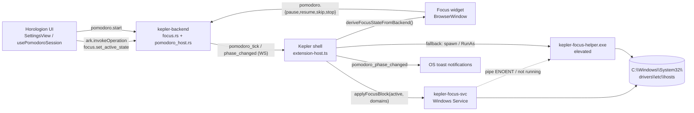

# Focus mode

Источник: `shell/electron/focus-*.ts` + `services/kepler-focus-helper/` + `services/kepler-focus-svc/` + `services/kepler-backend/src/focus.rs` + `services/kepler-backend/src/pomodoro_host.rs`.

## За 30 секунд

Focus mode — это подсистема Kepler, которая:

1. Показывает плавающий always-on-top **focus widget** (Spotify-mini-style, 320×52) с countdown'ом текущей pomodoro-фазы и кнопками pause/resume/skip/stop. Виджет работает **независимо** от окна Horologion — он живёт пока Kepler shell открыт, и тикает по wallclock anchor'у даже если Horologion закрыт / отрисовка throttle'нута Chromium'ом.
2. Блокирует **distracting домены** через запись в `C:\Windows\System32\drivers\etc\hosts` между маркерами `# === kepler-focus BEGIN/END ===`. Применением занимаются короткоживущие elevated процессы (`kepler-focus-helper.exe`) или постоянный Windows-сервис (`kepler-focus-svc`), который снимает UAC-промпт после первой установки.
3. Хранит **blocklist'ы** и **active state** в ARK (тип объекта `blocklist_obj` + `sync_kv` ключ `focus.active_state`) через модуль `services/kepler-backend/src/focus.rs`. Применение к hosts file делает **shell**, backend знает только state.

Pomodoro session при этом сама по себе живёт в backend'е (`pomodoro_host.rs`, persisted state) и переживает рестарт shell'а — focus widget гидратируется при старте через `pomodoro.get_state`.

::: warning Digital Cave ≠ focus-mode
[Digital Cave](/apps/digital-cave) — это **зарезервированное имя** будущего полноценного приложения-блокера (app-level blocks, hard mode, schedules). Текущий focus-mode покрывает только domain-block через hosts file + pomodoro widget UI. См. различия ниже.
:::

## Компоненты

| Файл / бинарь                                  | Что делает                                                                                                                                                                                                                                                                                                                                                     |
| ---------------------------------------------- | -------------------------------------------------------------------------------------------------------------------------------------------------------------------------------------------------------------------------------------------------------------------------------------------------------------------------------------------------------------- |
| `shell/electron/focus-widget.ts`               | Создаёт `BrowserWindow` 320×52, frameless, alwaysOnTop, transparent. Lazy create при первом `setFocusState({ active: true })`. Position персистится в `kepler-focus-widget-state.json`. Autonomous tick раз в секунду из main process по `phaseEndsAtMs` wallclock anchor'у — виджет не зависит от renderer'а Horologion. Подписан на backend pomodoro events. |
| `shell/electron/focus-block.ts`                | `applyFocusBlock({ active, domains })` — модифицирует hosts file. Тройной fallback: pipe-to-service → auto-install service (один UAC) → direct helper spawn (если Kepler сам admin) → elevated helper через `Start-Process -Verb RunAs` (UAC per-call).                                                                                                        |
| `shell/electron/focus-service.ts`              | TS-клиент для `kepler-focus-svc`: CLI invocations (install/uninstall/start/stop/status, elevation через PowerShell `RunAs`) + named-pipe IPC `\\.\pipe\kepler-focus-svc`.                                                                                                                                                                                      |
| `shell/src/views/FocusWidgetView.vue`          | Vue-renderer виджета. Получает state через `kepler:focus-widget:state` IPC, кнопки дёргают `pomodoro.{pause,resume,skip,stop}` через `invokeOperation`.                                                                                                                                                                                                        |
| `services/kepler-focus-helper/`                | Rust бинарь с `requireAdministrator` manifest. Читает один JSON request со stdin (или `--input <file>` если spawned через `Start-Process -Verb RunAs`), выполняет op над hosts file, печатает JSON response, exit. Маркер-секция + idempotent add/remove + backup в `hosts.kepler-backup` (один раз).                                                          |
| `services/kepler-focus-svc/`                   | Windows-сервис (LocalSystem, AutoStart). Listens на named pipe `\\.\pipe\kepler-focus-svc` с NULL-DACL (доступно user-mode процессам), переиспользует `kepler_focus_helper::hosts`. Sub-commands: `install`/`uninstall`/`start`/`stop`/`status`/`run-as-service`. После install — zero-UAC focus mode.                                                         |
| `services/kepler-backend/src/focus.rs`         | ARK operations: `focus.list_blocklists`, `focus.upsert_blocklist`, `focus.delete_blocklist`, `focus.get_active_state`, `focus.set_active_state`. Хранит **только state**, не трогает hosts file.                                                                                                                                                               |
| `services/kepler-backend/src/pomodoro_host.rs` | Singleton `Session` в `Arc<Mutex<...>>`, tokio ticker раз в секунду. Persisted state в `<data_dir>/pomodoro-state.json` (переживает рестарт shell + backend). Broadcast `pomodoro_tick` / `pomodoro_phase_changed` / `pomodoro_finished` через WS всем подписчикам.                                                                                            |
| `shell/electron/pomodoro-notifier.ts`          | OS-toast уведомления на phase_changed (work↔break) независимо от того, открыт ли Horologion.                                                                                                                                                                                                                                                                   |

## Поток данных



Ключевые инварианты:

- **Backend — source of truth для pomodoro lifecycle.** Все операции pause/resume/skip/stop проходят через `pomodoro.<op>` → backend → broadcast → подписчики. Виджет не дёргает `setFocusState` локально после кнопки; ждёт ответ backend'а.
- **Horologion renderer push'ит более богатый state**, чем backend знает (`blockingActive` из локального `focusBlocklistId` setting, `pomodoroDraft.title`). Когда Horologion закрыт — main process деривит state из backend events; когда открыт — Horologion-push побеждает (последний writer wins).
- **Widget tick autonomous.** `phaseEndsAtMs` (wallclock unix-ms) — anchor; main process пересчитывает `remainingSec` раз в секунду даже без push'ей от renderer'а. Без этого Chromium throttle'ит фоновый Horologion renderer и countdown в виджете замерзает.

## IPC / wire endpoints

### Electron IPC (shell main ↔ renderer)

| Канал                                                   | Направление          | Назначение                                                                   |
| ------------------------------------------------------- | -------------------- | ---------------------------------------------------------------------------- |
| `kepler:focus-widget:set-state`                         | renderer → main      | Horologion push'ит `Partial<FocusState>`                                     |
| `kepler:focus-widget:get-state`                         | renderer → main      | initial hydrate в `FocusWidgetView`                                          |
| `kepler:focus-widget:state`                             | main → renderer      | broadcast updated state виджету                                              |
| `kepler:focus-widget:hide`                              | renderer → main      | спрятать виджет (не destroy)                                                 |
| `kepler:focus-widget:open-horologion`                   | renderer → main      | click по label открывает Horologion                                          |
| `kepler:focus-widget:pomodoro:{pause,resume,skip,stop}` | renderer → main      | проксируется в `invokeOperation("pomodoro.<op>")`                            |
| `kepler:focus-widget:stopwatch:stop`                    | renderer → main      | закрывает running `time_entry_obj` (source=manual) напрямую через ARK upsert |
| `kepler:focus:applied`                                  | main → all renderers | результат `applyFocusBlock` (Settings показывает status)                     |
| `kepler:focus-service:status-changed`                   | main → all renderers | service install/uninstall — UI рефрешит карточку                             |

### ARK operations (backend)

`focus.list_blocklists` / `focus.upsert_blocklist` / `focus.delete_blocklist` / `focus.get_active_state` / `focus.set_active_state` — см. `services/kepler-backend/src/focus.rs`. `extension-host.ts` middleware'ом перехватывает `focus.set_active_state` от Horologion и после успешного ответа дёргает `applyFocusBlock(...)`.

### Pipe protocol (`\\.\pipe\kepler-focus-svc`)

JSON request → JSON response, single round-trip, pipe закрывается. См. `services/kepler-focus-svc/src/protocol.rs`:

```text
{"op":"add","domains":["tiktok.com","twitter.com"]}
{"op":"remove","domains":["twitter.com"]}
{"op":"reset"}
{"op":"status"}
{"op":"ping"}
```

Response: `{ok, active_domains?, error?, pong?}`. Helper bin использует тот же shape минус `ping`.

## Hosts file дисциплина

- Модификации только между маркерами `# === kepler-focus BEGIN ===` / `# === kepler-focus END ===`. Всё что вне маркеров — read-only.
- Перед первой модификацией создаётся `hosts.kepler-backup` (sibling). На `reset` восстанавливаем backup; если backup отсутствует — просто срезаем managed-секцию.
- `add` идемпотентен: нормализация (lowercase, strip `www.`), дедуп, sorted. Для каждого домена пишутся обе записи `127.0.0.1 <domain>` и `127.0.0.1 www.<domain>`.
- Запись атомарная: `<hosts>.tmp` → `rename` поверх + verify readback. На mismatch — `HostsError::Verify`.
- Override для тестов: env `KEPLER_FOCUS_HOSTS_PATH` (используют unit-тесты в `hosts.rs` и `protocol.rs`).

## Запреты

См. [полный список](/agents/forbidden#focus-mode). Кратко:

- ❌ Прямые манипуляции `BrowserWindow` focus widget'а из extension'ов. Только через `kepler:focus-widget:*` IPC.
- ❌ Обход `pomodoro_host` для lifecycle pomodoro-сессии. Никаких прямых state-mutations из shell — только `invokeOperation("pomodoro.<op>")`.
- ❌ Прямые writes в hosts file из любого места кроме `kepler-focus-helper` / `kepler-focus-svc`. Никаких inline `fs.writeFile("C:\\Windows\\...")` из shell или extension'ов.
- ❌ Запись вне маркерной секции в helper/svc — backup может не покрыть, юзер потеряет свои hosts entries.
- ❌ Destructive schema migration для `blocklist_obj` (см. [ARK objects](/concepts/ark-objects)).
- ❌ `setupFocusWidgetBackendSync` без последующего `teardownFocusWidgetBackendSync` при backend respawn — приведёт к двойной подписке после `resetArkClient`.

## Открытые вопросы / TODO

- App-level блокировка (process_name / window title) — не реализована. Это часть будущего [Digital Cave](/apps/digital-cave).
- Hard mode (нельзя выключить до конца таймера) — не реализован.
- Расписания (например, «будни 9–13») — не реализованы.
- Логирование попыток обхода (`block_attempt_obj`) — не реализовано.
- Browser-extension путь для domain blocks (как альтернатива hosts file) — не рассматривался.

## Связанные документы

- [Digital Cave](/apps/digital-cave) — будущая полноценная app-блокировка.
- [Horologion](/apps/horologion) — pomodoro-сессия, триггерящая focus-mode.
- [Command bus](/concepts/command-bus) — wire-format pomodoro events.
- [Extension host](/concepts/extension-host) — где живёт middleware `focus.set_active_state` → `applyFocusBlock`.
