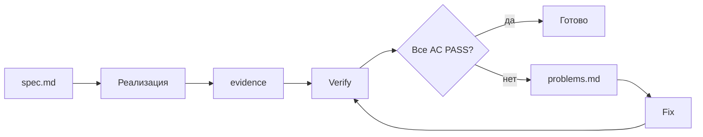

# Proof loop

Substantial-правки в репо проходят через формальный цикл доказательства в `.agent/tasks/<DATE>-<slug>/`. Это политика, закреплённая в корневом `AGENTS.md`.

## Когда применяется

| Тип правки                            | Proof loop?     |
| ------------------------------------- | --------------- |
| Новая фича приложения                 | ✅ да           |
| Нетривиальный рефактор                | ✅ да           |
| Нетривиальный багфикс                 | ✅ да           |
| Изменение data-слоя ARK / SDK / smoke | ✅ да           |
| Архитектурное решение                 | ✅ да, плюс ADR |
| Опечатка / форматирование             | ❌ нет          |
| Локальное переименование переменной   | ❌ нет          |
| Косметика README                      | ❌ нет          |
| Edit-level правка одной строки в UI   | ❌ нет          |

## Структура task-папки

```text
.agent/tasks/2026-04-26-ark-app-completion/
├─ spec.md             # AC1..ACn, замёрзлено до реализации
├─ evidence.md         # как и чем проверено
├─ evidence.json       # машино-читаемая копия evidence
├─ problems.md         # если не PASS — что и где не сошлось
├─ raw/                # сырые логи команд (часто command-results.md)
└─ smoke/              # изолированные тестовые БД и артефакты
```

Имя папки — `<YYYY-MM-DD>-<short-slug>`. Дата — день начала задачи.

## Последовательность



`evidence` — это `evidence.md` + `evidence.json`. `Verify` — свежий прогон команд против текущего состояния репо.

### 1. Заморозить spec

`spec.md` пишется **до** реализации. Включает:

- Цель и контекст.
- Скоуп (что в задаче, что нет).
- Acceptance Criteria, пронумерованные `AC1`, `AC2`, …
- Каждый AC формулируется как **проверяемое** утверждение, не «улучшить производительность».

Пример AC из реальной задачи:

> **AC1.** Arrancador ARK write-path audit passes: любые writes в ARK `objects`, `object_types`, `object_links`, или usage sync tables идут через `@kosmos/ark` APIs или Rust `ark_core` helpers, не через raw `better-sqlite3` SQL в app services.

Когда `spec.md` готов — он **не редактируется** в процессе реализации. Если что-то меняется по дороге — это либо новая задача, либо отдельное решение в `problems.md` с обоснованием.

### 2. Реализовать

Наименьший защитимый diff. Не тащи в одну задачу несвязанные правки.

### 3. Создать evidence

`evidence.md` — как ты проверил каждый AC. Каждый AC должен иметь:

- Команды, которые ты прогнал.
- Их вывод (или ссылку на `raw/<cmd>.md`).
- Явный вердикт: `PASS` или `FAIL`.

`evidence.json` — машино-читаемая копия:

```json
{
  "task_id": "2026-04-26-ark-app-completion",
  "verified_at": "2026-04-26T15:00:00Z",
  "results": [
    { "ac": "AC1", "verdict": "PASS", "command": "bun run ark:guard:writes" },
    { "ac": "AC2", "verdict": "PASS", "command": "bun run --cwd extensions/arrancador test" }
  ]
}
```

### 4. Свежая верификация

После записи evidence — прогон ещё раз, **с нуля**, против текущего кода. Verifier судит по текущему состоянию репо, не по предыдущим утверждениям в чате.

### 5. Если не PASS — `problems.md`

Описание, что именно не сошлось, минимальный безопасный fix, и **reverify** после fix'а.

## Жёсткие правила

::: danger Не нарушай

- Не объявляй задачу завершённой, пока **каждый** AC не `PASS`.
- Verifier судит по текущему коду и текущим выводам команд, не по предыдущим сообщениям в чате.
- Fixer делает наименьший защитимый diff. Не «попутно отрефакторил», только fix.
  :::

## Workflow-агенты

В репо лежат TOML/MD-описания специализированных агентов, помогающих с loop'ом:

- `.agents/agents/task-spec-freezer.{toml,md}` — помогает оформить `spec.md`.
- `.agents/agents/task-builder.{toml,md}` — реализация.
- `.agents/agents/task-verifier.{toml,md}` — независимая верификация.
- `.agents/agents/task-fixer.{toml,md}` — минимальные fix'ы.

## Зачем это всё

- **Auditable.** Через год можно открыть `.agent/tasks/<old>/` и понять, что и как делалось.
- **No drift.** Утверждения «сделано» подтверждены `evidence`, а не «я сказал так в чате».
- **AI-friendly.** Агент видит ровно те же критерии, что человек, и не уезжает в собственную интерпретацию.

## Связанные документы

- Корневой `AGENTS.md` — формальная политика.
- [Изоляция тестовых БД](/concepts/test-isolation) — каждая smoke-проверка использует свою БД.
- [Шаблоны спецификаций](/agents/spec-templates) — типовые spec'и для агента.
