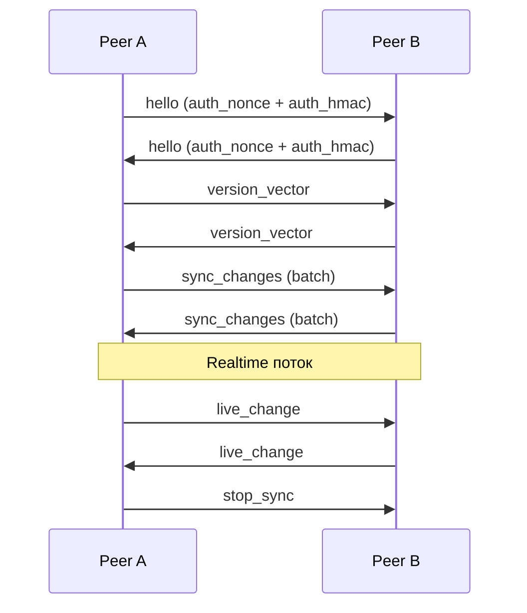

# Синхронизация

ARK поддерживает два транспорта синхронизации поверх одного протокола: **LAN** (peer-to-peer в локальной сети) и **relay** (через WebSocket-сервер, нужен для прохождения NAT).

## Запуск sync

Из TypeScript:

```ts
await ark.start();  // start_sync под капотом

ark.onPeerConnected((deviceId, deviceName) => { /* ... */ });
ark.onEntityChanged((entityJson) => { /* ... */ });

await ark.broadcastChange('object', 'obj-1', {
  type: 'object', id: 'obj-1',
  data: { /* ... */ },
  hlc: '0:0:device-1',
});

const peers = await ark.getConnectedPeers();
await ark.stop();
```

## Лайфцикл

1. Приложение вызывает `init` с `dbPath` (если sidecar self-managed).
2. CRUD операций над объектами / usage / query.
3. Опционально `start_sync` (с `auth_secret` и/или `relay_url`).
4. Sync поток в фоне обменивается фреймами с пирами.
5. `stop_sync` перед shutdown.



## LAN sync

UDP-beacon (`beacon.rs`) рассылает discovery в подсеть. Пиры, услышавшие beacon, открывают WebSocket-соединение и обмениваются sync-фреймами.

Self-peer фильтрация и фильтрация routable addresses — **обязательные инварианты**. Не ослабляй их при изменениях в sync startup.

## Relay sync

Если `start_sync` получает `relay_url`, sidecar поднимает relay-bridge параллельно LAN. Bridge соединяется с `ark-relay-server`, который раздаёт фреймы между подключёнными пирами.

Используется когда пиров разделяет NAT или они в разных сетях.

```ts
// в @kepler/ark
const ark = new ArkClient({
  spaceId: 'default',
  deviceId: 'device-1',
  deviceName: 'Workstation',
  authSecret: 'shared-space-secret',
  dbPath: '...',
  sidecarPath: '...',
  relayUrl: 'wss://relay.example/space/default',
});
```

## Auth — HMAC-аутентификация пиров

`auth_secret` (один и тот же на всех устройствах одного space) активирует HMAC-SHA256 аутентификацию `hello`-сообщения. Пиры без секрета не могут присоединиться к mesh.

::: warning Это аутентификация, не шифрование
HMAC доказывает знание секрета, но **трафик не шифруется**. Для шифрования используй WSS / TLS-туннель.
:::

## Фреймы протокола

Поверх WebSocket (LAN или relay) пиры обмениваются JSON-фреймами:

| Фрейм | Что |
|---|---|
| `hello` | Идентификация пира (+ HMAC при auth_secret) |
| `version_vector` | Текущий векторный clock пира |
| `sync_changes` | Батч изменений за период |
| `live_change` | Realtime-уведомление о новом изменении |
| `auth_nonce` + `auth_hmac` | Поля в `hello` при HMAC-auth |

Wire-формат остаётся `snake_case`. RPC-операции `ark-core-rpc` могут быть `camelCase` для совместимости с legacy Electron-вызовами.

## Hybrid Logical Clock (HLC)

`packages/ark-core/rust/src/hlc.rs`. Гибрид физического и логического времени. Каждое изменение получает HLC-метку вида `<timestamp_ms>:<counter>:<device_id>`. HLC даёт строгий партийный порядок событий для merge-resolution даже когда часы пиров разъезжаются.

HLC последнего apply хранится в `sync_kv`.

## Tombstones

Удаления распространяются через `sync_tombstones`. Без durable tombstone пир, который пропустил delete, при следующем sync «оживит» удалённую запись от своего version vector — это будет неправильно.

Apply-ошибки на стороне приёма возвращаются как `Result`, не игнорируются молча.

## Direct writers и version_vector

Если процесс пишет напрямую в SQLite (не через `ark-core-rpc`), он **обязан** вызвать `ark_core::db::bump_sync_version_vector` после каждой группы изменений. Иначе CRDT-merge на пирах сломается — они не узнают, что у этого пира есть новые данные.

Это касается `services/usage-tracker` и любых будущих Rust-writers.

## Текущие ограничения

- Relay sync **подключён** в `ark-core-rpc` и в UniFFI `ArkCore::start_sync`.
- LAN sync поддерживает **опциональную** HMAC-аутентификацию пиров, но трафик не шифруется.
- Generic object search использует SQLite FTS5 если доступен; fallback на in-memory matching если FTS не работает или запрос невалидный.

## Реализация

- `packages/ark-core/rust/src/sync_server.rs` — WebSocket sync сервер.
- `packages/ark-core/rust/src/sync_client.rs` — WebSocket sync клиент.
- `packages/ark-core/rust/src/relay_transport.rs` — outbound клиент к relay.
- `packages/ark-core/rust/src/relay_sync.rs` — relay bridge поверх sync.
- `packages/ark-core/rust/src/beacon.rs` — UDP discovery.
- `packages/ark-core/rust/src/mesh.rs` — координация LAN + relay.
- `packages/ark-core/rust/src/hlc.rs` — HLC.
- `packages/ark-core/rust/src/protocol.rs` — фреймы.
- `services/ark-relay-server/` — сам relay-сервер.
