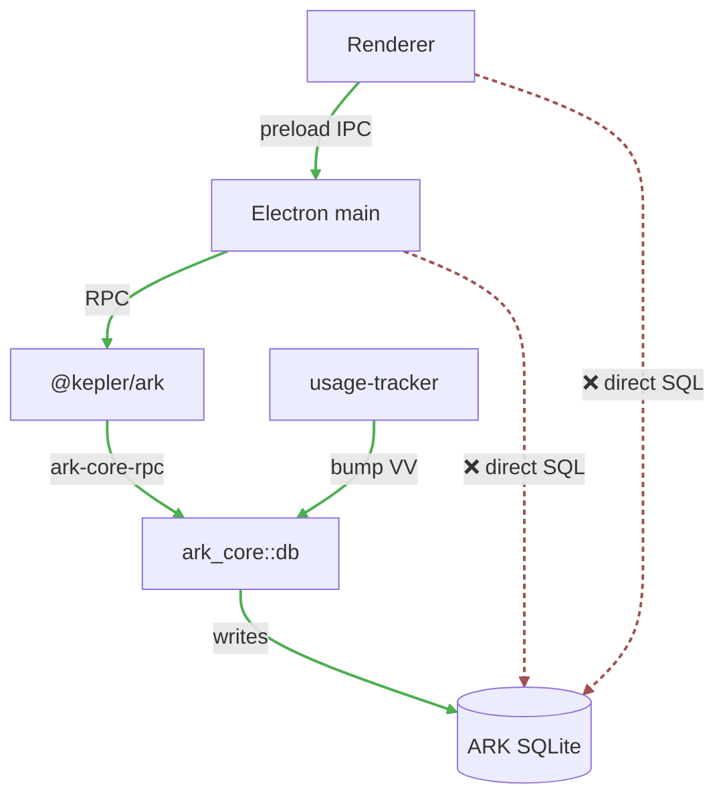

# Граница записи в ARK

## Правило

::: danger Жёстко
**Все записи** в ARK-данные идут через `@kepler/ark` (TS) или `ark_core::db` хелперы (Rust). Прямые SQL writes в `objects`, `object_types`, `object_links`, `tracked_apps`, `usage_sessions`, `usage_events` или `sync_kv` из app services **запрещены**.
:::

Это политика репо, закреплена в `docs/ARK-READONLY-SQL-BOUNDARY.md` и в `AGENTS.md` всех приложений.

## Почему

Прямой SQL `INSERT` / `UPDATE` / `DELETE` обходит:

1. **Sync state.** ARK не узнает, что у этого устройства появились новые данные — `lan_sync.version_vector` не обновится, пиры не получат изменение.
2. **Tombstones.** Удаления не пропагируются на пиры. При следующем sync они «оживят» удалённую запись.
3. **HMAC-auth.** Sync-протокол строит фреймы поверх внутренней модели — она не успеет узнать о записи до отправки в peer.
4. **Schema validation.** Runtime может валидировать payload по схеме типа объекта.
5. **Event delivery.** Подписчики (renderer'ы через `onEntityChanged`) не получат событие.
6. **Typed errors.** SQL-ошибки голые, без контекста ARK.

## Кому что можно

| Кто | Что разрешено |
|---|---|
| Electron renderer | Только preload API (`window.<app>Api`). Никакого SQLite вообще. |
| Electron main (app services) | `@kepler/ark`. Read-only SQLite — только как fallback, явно отделённый от writes. |
| Rust app code | `@kepler/ark` через sidecar, либо `ark_core::db` (если внутри одного процесса с runtime). |
| `services/kepler-backend/src/usage_tracker` (Rust) | Прямые писи через `ark_core::db` **с** обновлением `version_vector`. |
| Migration scripts | Могут читать **источник** напрямую, но writes в target ARK идут через ARK RPC/SDK. |
| Dashboard | Read-only SQLite инспекция. **Никаких** writes. |



- `M` (Electron main, app services) → `SDK` (`@kepler/ark`) → `CORE` (`ark_core::db` через `ark-core-rpc`) → `DB` (`ARK SQLite`: `objects`, `usage_*`, `sync_kv` …).
- `UT` (`usage-tracker`, Rust) — единственный, кому можно писать напрямую в `ark_core::db`, и **только** с вызовом `bump_sync_version_vector` (на схеме `bump VV`) после каждой записи в синхронизируемую таблицу.
- Пунктир с ❌ — то, что **запрещено**: и renderer, и Electron main не имеют права открывать SQLite напрямую.

## Что считается «прямой SQL write в ARK»

Из app service (`apps/*/electron/main/services/*.ts`):

```ts
// ❌ ЗАПРЕЩЕНО
const db = new Database(arkDbPath);
db.prepare("INSERT INTO objects (id, type_id, title) VALUES (?,?,?)").run(...);

// ❌ ЗАПРЕЩЕНО
db.prepare("UPDATE objects SET props_json = ? WHERE id = ?").run(...);

// ❌ ЗАПРЕЩЕНО
db.prepare("DELETE FROM tracked_apps WHERE id = ?").run(...);
```

Любая из этих строк будет поймана `bun run ark:guard:writes`.

## Как делать правильно

```ts
import { ArkClient } from '@kepler/ark';

const ark = new ArkClient({ /* ... */ });
await ark.start();

await ark.objects.upsert({
  id, typeId: 'task_obj', title,
  contentJson, propsJson,
  createdAt, updatedAt, deletedAt: null,
});

await ark.objects.delete(id);
```

## Read-only — можно

Чтение напрямую из SQLite — допустимо как **fallback** или для inspector-режима. Должно быть:

- В Electron **main**, никогда в renderer.
- В `mode=ro` (open read-only).
- Явно отмечено в коде как fallback.
- Не запускаться против user DB в автотестах.

Подробнее — [Read-only SQL boundary](/concepts/readonly-sql).

## Guard

Перед PR в data-слой:

```powershell
bun run ark:guard:writes
```

Скрипт — `scripts/check-ark-write-boundaries.mjs`. Проверяет, что app services не содержат `INSERT/UPDATE/DELETE` SQL в ARK-таблицы. Запуск обязателен при изменении файлов в:

- `extensions/arrancador/src/`
- `extensions/delphi/src/`
- `extensions/horologion/src/`
- `shell/electron/`
- `shell/src/dashboard/` (встроенный Dashboard view — read-only ARK browser)
- `apps/eden/ts/main/`

## Direct Rust writers — особый случай

`services/kepler-backend/src/usage_tracker` пишет напрямую в `tracked_apps` / `usage_sessions` / `usage_events`, потому что:

- Он Rust, не TypeScript.
- Он линкуется с `ark_core` напрямую как библиотека.
- Он использует `ark_core::db` хелперы, **которые сами** обновляют `version_vector`.

Это допустимо, но **только** через хелперы. Любой Rust writer **обязан** после прямой записи вызвать `ark_core::db::bump_sync_version_vector(&mut conn)` (или хелпер сделает это сам), иначе CRDT-merge сломается.

## Связанные документы

- `docs/ARK-READONLY-SQL-BOUNDARY.md` — источник правды.
- [Read-only SQL boundary](/concepts/readonly-sql) — что разрешено читать напрямую.
- [Модель данных ARK](/concepts/ark-objects) — какие таблицы существуют.
- [Синхронизация](/concepts/sync) — почему version_vector важен.
