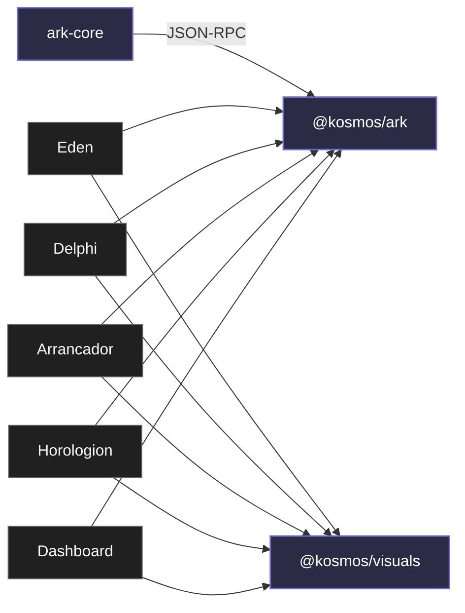

# Пакеты

`packages/` — это библиотеки и SDK, **которые что-то импортирует**. Долгоживущие daemon'ы и сервера лежат в [`services/`](/services/).

| Пакет                                | Что это                                                                                                                                                   |
| ------------------------------------ | --------------------------------------------------------------------------------------------------------------------------------------------------------- |
| [ark-core](/packages/ark-core)       | Rust crate + бинарь `ark-core-rpc`. Сам runtime ARK (SQLite + sync + relay-bridge). Embedded в Electron main как child process.                           |
| [@kosmos/ark](/packages/ark)         | TypeScript SDK, говорящий с `ark-core-rpc` по JSON-RPC. Канонический клиент к ARK для Electron main и Node-сервисов.                                      |
| [@kosmos/visuals](/packages/visuals) | UI: токены OKLCH, тема, общие Vue-компоненты (Sidebar, Titlebar, DesktopChrome, CommandPalette…). Используется всеми Electron-приложениями и этим сайтом. |

::: tip Соглашение об именах

- **Rust crate** — без scope: `ark-core` (у Cargo нет npm-style scopes).
- **TypeScript-пакет** — `@kosmos/*` (npm scope монорепо).

Папка в `packages/` может отличаться от npm-имени: `core/ark/packages/ark/` → `@kosmos/ark`, `packages/visuals/` → `@kosmos/visuals`. В коде импортируется по **npm-имени**, в файловой системе и docs-ссылках — по **папке**.
:::

## Граф зависимостей

- `ark-core` — Rust crate + бинарь `ark-core-rpc`. Стрелка к `@kosmos/ark` — JSON-RPC поверх stdin/stdout.
- `@kosmos/ark` — TS SDK, через который Electron-приложения говорят с runtime'ом.
- `@kosmos/visuals` — общие UI-компоненты и токены.

Сервисы (`usage-tracker`, `ark-relay-server`) тоже работают с ARK, но не импортируются из приложений — они **запускаются** независимо. См. [`/services/`](/services/).

## Правило выбора SDK

- Новая интеграция → **`@kosmos/ark`**.
- Direct Rust (внутри одного процесса с runtime) → `ark_core::db` хелперы.
- Renderer → preload API (`window.<app>Api`), **не** `@kosmos/ark`.

## Workspace-имена

| Папка                      | Имя в `package.json` / `Cargo.toml` | Язык             |
| -------------------------- | ----------------------------------- | ---------------- |
| `core/ark/crates/ark-core` | `ark-core` (Rust crate)             | Rust             |
| `core/ark/packages/ark`    | `@kosmos/ark`                       | TypeScript       |
| `packages/visuals`         | `@kosmos/visuals`                   | TypeScript + Vue |
