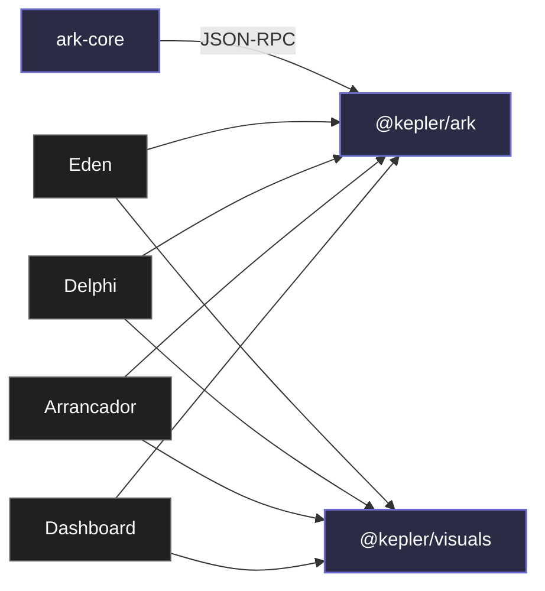

# Пакеты

`packages/` — это библиотеки и SDK, **которые что-то импортирует**. Долгоживущие daemon'ы и сервера лежат в [`services/`](/services/).

| Пакет | Что это |
|---|---|
| [ark-core](/packages/ark-core) | Rust crate + бинарь `ark-core-rpc`. Сам runtime ARK (SQLite + sync + relay-bridge). Embedded в Electron main как child process. |
| [@kepler/ark](/packages/kepler-ark) | TypeScript SDK, говорящий с `ark-core-rpc` по JSON-RPC. Канонический клиент к ARK для Electron main и Node-сервисов. Включает selected-space helpers. |
| [@kepler/visuals](/packages/kepler-visuals) | UI: токены OKLCH, тема, общие Vue-компоненты (Sidebar, Titlebar, DesktopChrome, CommandPalette…). Используется всеми Electron-приложениями и этим сайтом. |

::: tip Соглашение об именах
- **Rust crate** — без scope: `ark-core` (у Cargo нет npm-style scopes).
- **TypeScript-пакет** — `@kepler/*` (npm scope монорепо).

Папка в `packages/` может отличаться от npm-имени: `packages/kepler-ark/` → `@kepler/ark`, `packages/kepler-visuals/` → `@kepler/visuals`. В коде импортируется по **npm-имени**, в файловой системе и docs-ссылках — по **папке**.
:::

## Граф зависимостей

- `ark-core` — Rust crate + бинарь `ark-core-rpc`. Стрелка к `@kepler/ark` — JSON-RPC поверх stdin/stdout.
- `@kepler/ark` — TS SDK, через который Electron-приложения говорят с runtime'ом.
- `@kepler/visuals` — общие UI-компоненты и токены.

Сервисы (`usage-tracker`, `ark-relay-server`) тоже работают с ARK, но не импортируются из приложений — они **запускаются** независимо. См. [`/services/`](/services/).

## Правило выбора SDK

- Новая интеграция → **`@kepler/ark`**.
- Direct Rust (внутри одного процесса с runtime) → `ark_core::db` хелперы.
- Renderer → preload API (`window.<app>Api`), **не** `@kepler/ark`.

## Workspace-имена

| Папка | Имя в `package.json` / `Cargo.toml` | Язык |
|---|---|---|
| `packages/ark-core` | `ark-core` (Rust crate) | Rust |
| `packages/kepler-ark` | `@kepler/ark` | TypeScript |
| `packages/kepler-visuals` | `@kepler/visuals` | TypeScript + Vue |
