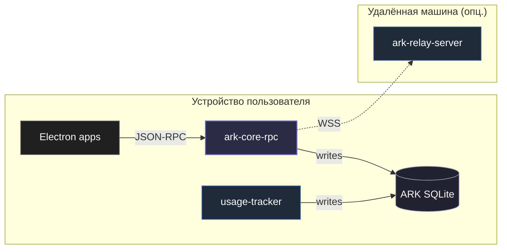

# Сервисы

`services/` — это долгоживущие бинари, **которые запускаются и крутятся**, в отличие от [`packages/`](/packages/), которые что-то импортирует. Сервисы говорят с ARK, но сами не SDK.

| Сервис                                         | Что это                                                                                                                                                                                                                                                      |
| ---------------------------------------------- | ------------------------------------------------------------------------------------------------------------------------------------------------------------------------------------------------------------------------------------------------------------ |
| [usage-tracker](/services/usage-tracker)       | Rust фон-сервис на устройстве. Следит за активным окном Windows, пишет sessions/events в ARK через `ark_core::db` хелперы (с обновлением `lan_sync.version_vector`).                                                                                         |
| [ark-relay-server](/services/ark-relay-server) | Rust WebSocket-сервер на удалённой машине. Опциональный посредник для p2p sync через NAT — релеит фреймы между пирами одного `spaceId`. Не хранит данные.                                                                                                    |
| `kepler-focus-helper`                          | Rust elevated short-lived process. Читает один JSON request (stdin или `--input`), модифицирует Windows hosts file между маркерами `# === kepler-focus BEGIN/END ===`, печатает JSON response, exit. См. [focus-mode](/concepts/focus-mode).                 |
| `kepler-focus-svc`                             | Rust Windows Service (LocalSystem, AutoStart). Слушает named pipe `\\.\pipe\kepler-focus-svc`, переиспользует `kepler_focus_helper::hosts`. После установки даёт zero-UAC focus mode (одна UAC-проверка на install). См. [focus-mode](/concepts/focus-mode). |

## Где они живут

- `Electron apps` — Eden, Delphi, Arrancador, Dashboard. Каждый дёргает `ark-core-rpc` через `@kosmos/ark` (JSON-RPC по stdin/stdout).
- `usage-tracker` пишет в ту же SQLite, но **минуя sidecar** — напрямую через `ark_core::db`-хелперы, обязательно вызывая `bump_sync_version_vector` после каждой записи.
- `ark-relay-server` подключается опционально: если у space'а задан `relay_url`, `ark-core-rpc` поднимает WSS-bridge к нему параллельно LAN sync.

`usage-tracker` всегда нужен (если хочешь usage-данные). `ark-relay-server` опционален — нужен только когда LAN sync между устройствами невозможен (разные подсети, NAT, мобильная сеть).

## Правила для прямых writers (services)

Сервисы — единственное место в репо, где разрешён **прямой Rust-write** в ARK SQLite (минуя `@kosmos/ark` / `ark-core-rpc`). Жёсткое условие:

- Запись через `ark_core::db` хелперы, не через сырой `rusqlite`.
- После каждой записи в синхронизируемую таблицу — `ark_core::db::bump_sync_version_vector`.
- Default DB path остаётся user-level (`%APPDATA%\Kosmos\ark.db`), не системный.

Подробнее — [Граница записи в ARK](/concepts/write-boundary).
