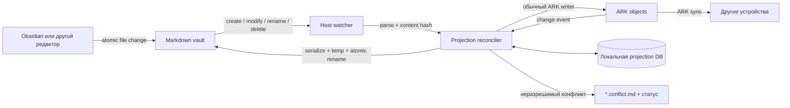
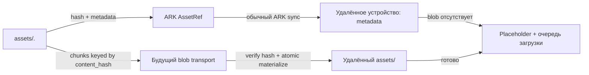

# Eden ↔ Obsidian: отложенная архитектура синхронизации

> Статус: **отложено, не реализовывать без нового явного решения**
> Дата фиксации: 2026-07-10
> Назначение: постоянная точка возврата к продуктовым и техническим решениям

## Коротко

Сейчас главная задача — писать заметки и заниматься, а не строить ещё одну
систему синхронизации. Obsidian можно использовать как самостоятельный рабочий
инструмент. Eden не должен срочно становиться зеркалом Obsidian, а этот документ
не является командой начинать реализацию.

Если к интеграции вернёмся, она должна оставаться максимально узкой:

- Markdown-мост работает только с обычными заметками;
- дневник остаётся ARK-native и никогда не становится двусторонним набором
  файлов `YYYY-MM-DD.md`;
- Markdown остаётся читаемым без Eden;
- стабильная идентичность заметок и вложений не зависит от пользовательских
  названий;
- ни один конфликт не должен молча уничтожать данные;
- Git, история версий, обязательный Obsidian-плагин и blob-sync не входят в
  первую реализацию.

## Почему работа отложена

Первоначальная идея «добавить watcher» быстро превращается в отдельный продукт:
нужны правила владения данными, двусторонний Markdown-кодек, разрешение
конфликтов, идентичность файлов, синхронизация вложений, восстановление после
сбоев и поведение на нескольких устройствах.

Пока Eden не является основным стабильным редактором пользователя, стоимость
такой системы выше её пользы. Открытый формат Obsidian позволяет отложить
решение без блокировки данных: реальный vault позднее можно импортировать и
использовать как набор тестовых примеров.

### Когда возвращаться к плану

Возвращение оправдано, если выполнено хотя бы одно условие:

1. Eden снова стал регулярно используемым редактором заметок.
2. Одноразовый импорт приходится повторять и это создаёт измеримую боль.
3. Одни и те же заметки действительно нужно редактировать и в Eden, и в
   Obsidian.
4. Появилась реальная потребность видеть Eden-вложения на нескольких
   устройствах.

До этого момента правильная реализация — отсутствие реализации.

## Текущее состояние репозитория

Eden уже содержит одноразовый обмен с Markdown и Obsidian:

- `products/eden/src/lib/obsidianVault.ts` разбирает Markdown, frontmatter,
  wikilinks и изображения;
- `products/eden/src/lib/obsidianVaultExport.ts` собирает экспорт vault;
- `products/eden/src/lib/markdownFrontmatter.ts` формирует документ с
  frontmatter;
- `products/eden/src/components/settings/ExportSettings.vue` запускает импорт
  и экспорт;
- `platform/desktop/electron/extension-markdown-vault.ts` читает Markdown и
  изображения из выбранной папки;
- `platform/desktop/electron/extension-markdown-ipc.ts` записывает экспорт.

Это отправная точка, а не готовая двусторонняя система. Сейчас импорт сканирует
vault целиком, экспорт формирует отдельный снимок, а постоянного watcher,
локальной таблицы проекции и протокола конфликтов нет.

Текущий bubble-дневник также не является ARK-native: новые bubbles сохраняются
в `localStorage` из
`products/eden/src/components/bubbles/BubbleDiaryView.vue`. Перенос дневника
в ARK — отдельная задача сохранности данных и не должен зависеть от
Obsidian-интеграции.

Исторический документ
`.agent/tasks/2026-06-13-eden-markdown-storage/spec.md` описывает более раннюю
идею ARK-authoritative файловой проекции. Он остаётся неизменным как история
решений. Раздел про будущий Obsidian bridge не следует воспринимать как
актуальную команду к реализации; актуальная точка возврата — этот файл.

## Границы доменов

### Что потенциально входит в Markdown-мост

- только обычные заметки системного типа note;
- заголовок, Markdown-тело и минимальный служебный frontmatter;
- папки заметок, если будет выбран однозначный mapping;
- обычные относительные ссылки на вложения.

### Что не входит

- bubble-дневник;
- задачи;
- типизированные объекты Eden;
- настройки, UI-state и layout TipTap;
- Git-интеграция;
- история редакций;
- произвольный файловый sync;
- обязательный Obsidian community plugin;
- синхронизация бинарных blobs на первом этапе.

Эти границы не запрещают будущие расширения. Они предотвращают превращение
первой полезной версии в перенос всей объектной модели Eden в Markdown.

## Дневник: только ARK

Дневник — это журнал объектов, а не документ дня. Представление
`YYYY-MM-DD.md` с буллетами читаемо, но не подходит в качестве двустороннего
источника истины: отступы начинают кодировать связи, перемещение строки меняет
граф, а стабильную идентичность приходится прятать в комментариях.

Целевая модель bubble:

```text
JournalBubble {
  id
  occurred_at
  local_date
  content_json
  kind
  tags[]
  parent_bubble_id?
  context_object_id?
  created_at
  updated_at
  deleted_at?
}
```

- каждый bubble — отдельный ARK-объект;
- день — запрос и группировка по `local_date`, а не отдельный объект-контейнер;
- вложенный bubble ссылается на родителя через `parent_bubble_id`;
- bubble, относящийся к заметке, задаче или другому объекту, использует
  `context_object_id`;
- удаление остаётся soft-delete;
- все записи проходят через штатный ARK writer и получают обычную
  version-vector семантику.

Eden не создаёт `Daily/YYYY-MM-DD.md` и никогда не преобразует такие файлы
обратно в bubbles. Если в подключённом vault уже есть Obsidian Daily folder, по
умолчанию она исключается из моста. Её явное включение может означать только
обычные заметки «один файл — один note object», но не импорт строк как bubbles.
Если когда-либо понадобится читать ARK-дневник в Obsidian, допустим только
отдельный односторонний экспорт, который не импортируется обратно.

Первый независимый шаг при возвращении к Eden — миграция существующих
`localStorage` bubbles в ARK с идемпотентным marker. Это не требует
Obsidian-моста.

## Модель обычной Markdown-заметки

### Стабильная идентичность

Путь и заголовок могут изменяться, поэтому идентичность живёт в минимальном
frontmatter:

```yaml
---
eden:
  id: "opaque-ark-object-id"
  schema_version: 1
title: "Название заметки"
---
Обычное читаемое Markdown-тело.
```

Обязательным является только `eden.id`. Поля, которые часто меняются
(`updated_at`, hash, sync-status), не следует писать в Markdown: они создают
лишний шум и хранятся в локальном состоянии проекции.

Новый файл без `eden.id` потенциально обрабатывается так:

1. watcher читает стабильное содержимое файла;
2. через ARK writer создаётся обычная заметка;
3. выданный ARK id атомарно добавляется во frontmatter;
4. локальная таблица проекции связывает id и относительный путь.

Переименование или перемещение файла сохраняет `eden.id` и поэтому не создаёт
новый объект.

### Читаемость без Eden

- существенный пользовательский текст всегда остаётся в Markdown-теле;
- идентичность и минимальная структурная метаинформация допустимы во
  frontmatter;
- скрытые HTML-комментарии не должны быть единственным носителем данных;
- абсолютные пути и внутренние URL Eden не попадают в переносимый Markdown;
- заметка должна оставаться полезной в Obsidian и обычном текстовом редакторе.

## Локальное состояние проекции

Watcher не должен хранить свои технические данные в синхронизируемых ARK
таблицах или постоянно переписывать frontmatter. Нужна отдельная host-local
таблица, концептуально:

```text
NoteProjection {
  note_id
  vault_id
  relative_path
  last_file_hash
  last_ark_version
  last_applied_operation?
  sync_state
  last_error?
}
```

`mtime` можно использовать только как подсказку для быстрого сканирования.
Фактическое равенство определяется hash нормализованного файла и ARK-версией.

Локальное состояние разрешено потерять и восстановить повторным reconciliation.
Оно не является источником пользовательских данных.

## Рабочая гипотеза владения данными

Окончательный источник истины намеренно остаётся открытым вопросом. Рабочая
гипотеза из обсуждения:

- ARK отвечает за offline-first хранение и синхронизацию заметок между
  устройствами;
- Markdown — локальная, нативно редактируемая файловая проекция той же заметки;
- Git не является вторым каналом синхронизации;
- изменения допустимы с обеих сторон, поэтому нужен общий base для обнаружения
  конкурентного редактирования.

Перед реализацией эту гипотезу нужно подтвердить на реальном пользовательском
сценарии. Если достаточно одноразового импорта, двустороннего источника истины
вообще не должно появляться.

## Поток Markdown ↔ ARK



### Инициализация

1. Проверить выбранный vault и разрешённые границы пути.
2. Просканировать только Markdown-файлы, исключив служебные и conflict-файлы.
3. Прочитать `eden.id`, вычислить hash и сопоставить локальную проекцию.
4. Отдельно классифицировать:
   - известный id и неизменённое содержимое;
   - известный id и изменение;
   - новый файл без id;
   - дубликат id;
   - файл с некорректным frontmatter;
   - ARK-объект без локального файла.
5. До завершения классификации ничего массово не перезаписывать и не удалять.

Первое подключение непустого vault всегда является reconciliation, а не
безусловным импортом или экспортом.

### Изменение файла → ARK

1. Скоалесить серию событий сохранения.
2. Дождаться стабильного чтения файла.
3. Вычислить content hash.
4. Проверить, не является ли событие результатом собственной записи.
5. Разобрать frontmatter и Markdown.
6. Сравнить file hash и ARK version с последним общим base.
7. При отсутствии конфликта записать изменение через ARK writer.
8. Обновить локальную проекцию только после успешной ARK-записи.

Прямые SQL writes из renderer или watcher запрещены.

### Изменение ARK → файл

1. Получить ARK change event.
2. Сопоставить объект с относительным путём.
3. Проверить, не изменился ли файл независимо от последнего base.
4. Сериализовать Markdown без потери неизвестного поддерживаемого текста.
5. Записать временный файл в той же директории.
6. Выполнить atomic rename.
7. Сохранить operation marker, новый hash и ARK version.
8. Проигнорировать соответствующее событие watcher по operation/hash, а не по
   ненадёжному таймауту.

### Rename и delete

- rename сохраняет `eden.id` и обновляет `relative_path`;
- вопрос «меняет ли rename заголовок?» остаётся открытым;
- внешнее удаление известного файла предлагает или выполняет soft-delete
  ARK-объекта согласно будущей подтверждённой политике;
- массовое исчезновение файлов при недоступном диске, изменённом vault root или
  ошибке доступа не считается пользовательским удалением;
- ARK soft-delete проецируется через безопасное перемещение в trash, а не через
  необратимый delete, если файловая сторона будет реализована.

## Подавление sync-loop

Нельзя полагаться только на debounce или `mtime`. Минимальная комбинация:

- hash содержимого после последней принятой записи;
- ARK version/version-vector;
- уникальный id локальной операции;
- атомарная запись файла;
- идемпотентная обработка повторных filesystem events.

Watcher пропускает событие только если содержимое совпадает с результатом
конкретной собственной операции. Совпадение по времени без совпадения hash не
является доказательством.

## Конфликты без истории версий

История редакций сейчас не планируется, поэтому конфликт обязан сохранять обе
актуальные версии сам.

Конфликт обнаружен, если с момента общего base одновременно изменились file
hash и ARK version.

Безопасное поведение по умолчанию:

1. не перезаписывать ни файл, ни ARK-объект;
2. оставить локальный файл на исходном пути;
3. записать входящую ARK-версию как
   `<name>.eden-conflict-<timestamp>.md`;
4. пометить conflict-файл служебным frontmatter, чтобы watcher не импортировал
   его как новую обычную заметку;
5. сохранить статус конфликта в локальной projection DB;
6. после ручного выбора или merge записать результат как новую текущую версию
   в ARK и основной файл.

Автоматический last-write-wins может быть добавлен только как явная настройка и
всё равно обязан сохранять проигравшую версию.

| Состояние относительно общего base | Действие                                      |
| ---------------------------------- | --------------------------------------------- |
| Изменился только файл              | Записать файл в ARK                           |
| Изменился только ARK               | Атомарно обновить файл                        |
| Ничего не изменилось               | Ничего не делать                              |
| Изменились оба                     | Заморозить mapping и сохранить conflict-копию |

## Markdown ↔ TipTap

### Правило обратимости

Новая TipTap-функция допускается в синхронизируемой заметке только при наличии:

1. parser Markdown → TipTap;
2. serializer TipTap → Markdown;
3. тестов round-trip;
4. читаемого fallback вне Eden;
5. определённого поведения для неизвестного или повреждённого синтаксиса.

Приоритет форматов:

1. CommonMark/GFM;
2. нативный и широко используемый Obsidian-синтаксис;
3. маленькое читаемое расширение Eden;
4. отказ от функции, если обратимого представления нет.

### Цветные блоки

Кандидат для цветного блока — Obsidian callout, например:

```markdown
> [!eden-red] Важное
> Текст цветного блока остаётся обычным Markdown.
```

Без Eden/CSS блок остаётся читаемым blockquote/callout. Существенный текст не
прячется в HTML или JSON-комментарий.

### Неизвестный синтаксис

- показывать как обычный редактируемый текст, а не удалять;
- при подключении vault один раз объяснить, что кастомный Obsidian-синтаксис
  может отображаться не полностью;
- для конкретной заметки достаточно ненавязчивого status badge;
- повторяющаяся модалка при каждом открытии не нужна;
- чисто визуальное состояние TipTap хранится вне Markdown.

[Tiptap Markdown](https://tiptap.dev/docs/editor/markdown) можно использовать
как компонент codec, но не как гарантию полной совместимости. UX-ориентиры:
[Obsidian callouts](https://obsidian.md/help/callouts) и readable-Markdown
подход [Octarine](https://docs.octarine.app/editor/basics).

## Вложения: один файл, ARK-идентичность

### Почему файлы, а не SQLite BLOB

Для этой интеграции хранение байтов в файловой системе предпочтительнее:

- Obsidian нативно видит обычные вложения;
- Eden и Obsidian читают один локальный файл без второй копии;
- большие файлы можно читать и передавать потоково;
- SQLite не раздувается бинарными данными и WAL-записями;
- vault остаётся переносимым без специального плагина.

Цена решения:

- файл и метаданные нельзя обновить одной SQLite-транзакцией;
- нужны atomic file writes, поиск orphan-файлов и проверка целостности;
- ARK sync метаданных сам по себе не переносит байты;
- для нескольких устройств потребуется отдельный blob transport.

Для данного сценария эти ограничения меньше, чем цена хранения единственной
копии внутри непрозрачной БД, которую Obsidian не умеет использовать как
обычное вложение.

[Obsidian хранит vault как обычную папку](https://obsidian.md/help/Files%2Band%2Bfolders/How%2BObsidian%2Bstores%2Bdata),
а [вложения являются обычными файлами vault](https://obsidian.md/help/attachments).

### Идентичность и путь

Рабочая модель:

```text
AssetRef {
  asset_id
  relative_path
  content_hash
  mime_type
  size_bytes
  original_name
  created_at
  deleted_at?
}
```

Канонический локальный путь:

```text
assets/<asset_id>.<ext>
```

- `asset_id` — стабильный ARK object id;
- `content_hash` проверяет целостность и позволяет будущую дедупликацию;
- `original_name` используется только для UI/alt text;
- абсолютный vault root является настройкой конкретного устройства;
- Markdown содержит относительную ссылку
  ``;
- ARK-связи и обратные ссылки используют `asset_id`, а не имя файла.

Переименование пользовательского display name не ломает ссылку. Ручное
переименование самого файла, удаляющее `asset_id`, требует отдельной политики
и остаётся открытым вопросом.

### Приём нового вложения

1. Получить исходный файл или Obsidian-created attachment.
2. Назначить `asset_id` и определить расширение по проверенному MIME.
3. Скопировать байты во временный файл внутри `assets/`.
4. Потоково вычислить `content_hash` и размер.
5. Выполнить atomic rename в `assets/<asset_id>.<ext>`.
6. Через ARK writer создать метаданные AssetRef.
7. Только после успеха вставить относительную Markdown-ссылку.

Если ARK-запись не удалась после atomic rename, остаётся безопасный orphan без
ссылок. Фоновый integrity scan сможет удалить его после grace period. Обратный
порядок хуже: он создаёт ARK-объект, указывающий на отсутствующие байты.

### Удаление и garbage collection

- удаление AssetRef сначала является soft-delete;
- физические байты не удаляются, пока остаются ссылки или возможна синхронизация
  старого состояния;
- orphan и unreferenced blobs удаляются только после grace period;
- integrity scan различает missing, orphan, hash mismatch и permission error;
- автоматическая очистка не запускается при недоступном vault root.

### Будущий blob-sync



ARK metadata sync и blob transfer — разные слои. Получатель сначала может
получить заметку и AssetRef, показать placeholder, затем запросить байты по
`content_hash` и атомарно материализовать файл в локальном vault.

До отдельного решения не фиксируются:

- transport и chunk protocol;
- лимиты размера;
- encryption at rest/in transit;
- retry/backpressure;
- eager или lazy download;
- retention удалённых blobs;
- квоты и поведение без места на диске.

### Вложения, созданные Obsidian

Obsidian обычно создаёт файл с пользовательским именем. Перед реализацией нужно
выбрать одно из двух:

1. watcher назначает `asset_id`, атомарно переименовывает файл и переписывает
   Markdown-ссылку;
2. путь остаётся пользовательским, а локальный manifest связывает path/hash с
   `asset_id`.

Первый вариант проще для восстановления идентичности на другом устройстве, но
вмешивается в файлы пользователя. Второй менее заметен, но добавляет manifest и
сложнее переживает rename. Решение намеренно не принято без теста на реальном
vault.

## Git и история изменений

Git не входит в текущую архитектуру:

- ARK не должен конкурировать с Git как второй автоматический sync authority;
- приложение не хранит GitHub tokens;
- автоматический pull/merge не проектируется;
- локальная или постоянная история редакций не реализуется;
- Anytype-подобная история остаётся возможной отдельной продуктовой функцией.

Если позднее понадобится резервное копирование vault, Git или другой backup
следует проектировать отдельно от live sync.

## Этапы возможной реализации

### Этап 0 — сейчас

- ничего не реализовывать;
- пользоваться Obsidian;
- собирать реальные примеры Markdown и вложений;
- не создавать watcher, plugin, Git automation или blob store.

### Этап 1 — надёжность дневника

- отдельно мигрировать bubbles из `localStorage` в ARK;
- добавить parent/context relations только согласно реальному UI;
- проверить soft-delete и multi-device ARK sync;
- не создавать Markdown-представление дневника.

### Этап 2 — проверка одноразового импорта

- взять копию реального vault;
- прогнать существующий импорт без записи в оригинал;
- собрать несовместимый синтаксис и реальные форматы вложений;
- решить, достаточно ли одноразового импорта;
- остановиться, если постоянного моста не требуется.

### Этап 3 — односторонняя ARK → Markdown проекция

- только обычные заметки;
- минимальный frontmatter с `eden.id`;
- атомарная запись;
- локальная projection DB;
- без обратного watcher и без удаления ARK по файлу.

### Этап 4 — двусторонний watcher

Только после доказанной необходимости:

- reconciliation;
- new-file import;
- rename/delete;
- hash/version loop suppression;
- конфликт-копии;
- warning для неизвестного синтаксиса.

### Этап 5 — вложения между устройствами

Только после стабильной текстовой синхронизации:

- AssetRef;
- integrity scan;
- missing-blob UI;
- blob transport;
- GC и квоты.

Каждый этап должен иметь самостоятельную пользовательскую ценность и может
стать последним.

## Failure modes и обязательное поведение

| Сценарий                                 | Безопасное поведение                                                                                          |
| ---------------------------------------- | ------------------------------------------------------------------------------------------------------------- |
| Vault временно недоступен                | Пауза; не считать все файлы удалёнными                                                                        |
| Некорректный frontmatter                 | Ошибка конкретного файла; не перезаписывать его                                                               |
| Два файла с одним `eden.id`              | Пометить конфликт identity; не объединять молча                                                               |
| ARK и файл изменились одновременно       | Сохранить обе версии                                                                                          |
| Watcher получает собственную запись      | Игнорировать по operation/hash                                                                                |
| Сбой во время записи Markdown            | Старый файл остаётся целым благодаря temp + rename                                                            |
| Сбой после записи asset, до ARK metadata | Безопасный orphan для будущего GC                                                                             |
| Asset metadata есть, файла нет           | Placeholder; не удалять ссылку                                                                                |
| Hash вложения не совпадает               | Не показывать как валидное; запросить восстановление                                                          |
| Массовые file delete events              | Остановить и запросить подтверждение/reconciliation                                                           |
| Неизвестный Markdown                     | Сохранить как текст, не удалять                                                                               |
| В vault найден дневной файл              | По умолчанию исключить Daily folder; даже при явном включении никогда не преобразовывать строки в ARK bubbles |

## Будущие проверочные сценарии

Перед выпуском соответствующего этапа должны существовать проверки:

1. Создание заметки в Obsidian → один ARK object → `eden.id` появляется один
   раз.
2. Создание заметки в Eden → читаемый Markdown → повторный scan не создаёт
   дубликат.
3. Rename и перемещение сохраняют object id.
4. Удаление не превращается в hard delete.
5. ARK remote change обновляет файл и не вызывает бесконечный sync-loop.
6. Одновременные изменения создают conflict-копию и сохраняют обе версии.
7. Неизвестный Obsidian-синтаксис переживает открытие и сохранение без
   исчезновения.
8. Цветной блок round-trip сохраняет текст и callout.
9. Вложение открывается Eden и Obsidian из одного локального файла.
10. Изменение display name вложения не ломает ARK relation.
11. Missing blob показывает placeholder и восстанавливается после загрузки.
12. Crash между временной записью и rename не повреждает существующий файл.
13. Crash между materialize asset и ARK metadata оставляет только обнаружимый
    orphan.
14. Дневник и bubbles никогда не появляются в двустороннем vault.
15. Недоступный vault не вызывает массовый soft-delete.

## Открытые вопросы

1. Нужен ли вообще постоянный мост или достаточно улучшить одноразовый импорт?
2. Кто окончательно является authority при двустороннем редактировании: ARK,
   Markdown или явно выбранный режим?
3. Должно ли переименование файла менять title заметки?
4. Как отражать Eden folders в файловой структуре?
5. Нужно ли разрешать автоматический last-write-wins?
6. Какой UI разрешения конфликтов минимально достаточен?
7. Нужно ли автоматически нормализовать имена Obsidian-вложений в
   `asset_id`?
8. Допустима ли локальная asset manifest или id обязан жить в имени файла?
9. Нужны ли дедупликация одинаковых байтов и immutable assets?
10. Какие лимиты, шифрование, квоты и retention нужны будущему blob-sync?
11. Нужна ли мобильная совместимость Obsidian?
12. Какие реальные TipTap-расширения требуют Markdown codec?
13. Нужна ли когда-либо односторонняя выгрузка дневника для чтения?
14. Как мигрировать и проверить существующие `localStorage` bubbles?
15. Какое конкретное пользовательское неудобство является достаточным
    основанием перейти от этапа 0 к этапу 1 или 2?

Эти вопросы намеренно оставлены открытыми. Их нельзя решать «для полноты»
раньше, чем появится реальный сценарий.

## Архитектурные инварианты

- Пользовательские данные никогда не удаляются из-за временно недоступной
  папки.
- Ни одна сторона не перезаписывается при доказанном конфликте.
- Все синхронизируемые ARK writes проходят через штатный writer и version
  vector.
- Локальная projection DB восстанавливаема и не является источником данных.
- Идентичность не зависит от title или пользовательского filename.
- Существенный текст заметки остаётся читаемым Markdown.
- Дневник не кодируется структурой Markdown-буллетов.
- Бинарные байты имеют одну каноническую локальную копию.
- Метаданные и blob transport остаются разными слоями.
- Git и live sync не смешиваются без нового архитектурного решения.
- Каждый новый этап начинается только после доказанной пользовательской
  потребности.

## Справочные материалы

- [Obsidian: How Obsidian stores data](https://obsidian.md/help/Files%2Band%2Bfolders/How%2BObsidian%2Bstores%2Bdata)
- [Obsidian: Attachments](https://obsidian.md/help/attachments)
- [Obsidian Developer Docs: Vault API](https://docs.obsidian.md/Plugins/Vault)
- [Obsidian: Callouts](https://obsidian.md/help/callouts)
- [Tiptap Markdown](https://tiptap.dev/docs/editor/markdown)
- [Octarine editor basics](https://docs.octarine.app/editor/basics)
- [Octarine text color](https://docs.octarine.app/editor/text-color)
- [Octarine callouts](https://docs.octarine.app/editor/callout)
- [Octarine tables](https://docs.octarine.app/editor/tables)

## Решение на сегодня

План сохранён именно для того, чтобы не держать архитектуру в голове и не
реализовывать её из страха «потом забыть». На сегодня:

- Obsidian можно использовать самостоятельно;
- Eden ↔ Obsidian sync не строится;
- Git и история не добавляются;
- дневник не переносится в Markdown;
- следующий разговор начинается с реальной боли и этого документа, а не с
  повторного проектирования с нуля.
